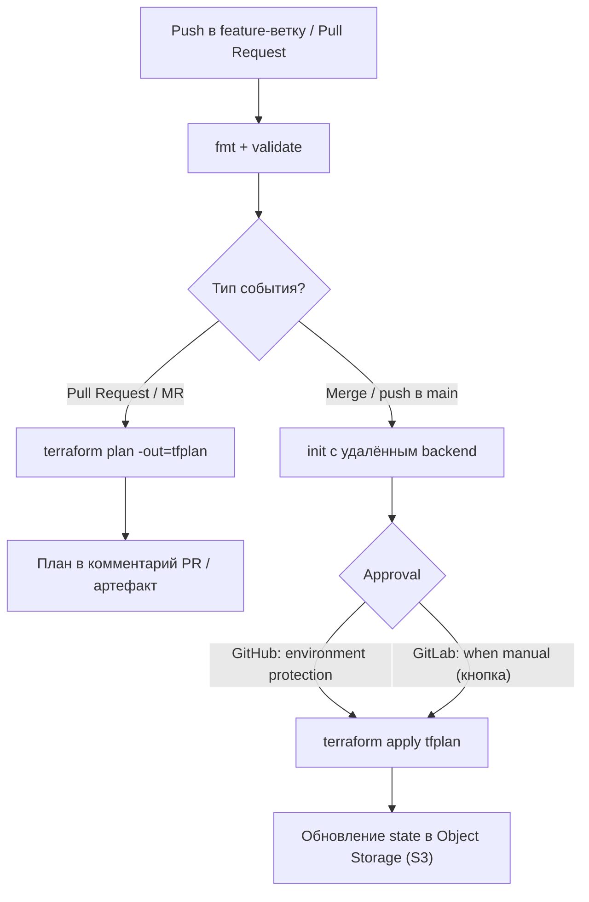

# Задание 2 — CI/CD и удалённое хранение состояния Terraform

Проект: платформа **«Будущее 2.0»** (медицина + финтех + ИИ-сервисы).
Облако — **Yandex Cloud**, IaC — **Terraform**, CI/CD — **GitHub Actions** и (эквивалент) **GitLab CI**.

Ключевое требование: **состояние Terraform не хранится локально**. Оно лежит
в S3-совместимом объектном хранилище **Yandex Object Storage** (endpoint
`storage.yandexcloud.net`), с альтернативой на **Minio** для локальной/on-prem среды.

---

## 1. Структура каталога

```text
Task2/
├── .github/
│   └── workflows/
│       └── terraform.yml         # GitHub Actions: fmt/validate, plan (PR), apply (main/manual)
├── .gitlab-ci.yml                # GitLab CI: stages validate/plan/apply, manual apply
├── .gitignore                    # игнор state, tfvars, ключей, планов
├── SOLUTION.md                   # этот файл
└── terraform/
    ├── backend.tf                # backend "s3" -> Yandex Object Storage (удалённый state)
    ├── backend.hcl.example       # пример -backend-config (bucket/key), НЕ в git
    ├── versions.tf               # required_version + required_providers (yandex)
    ├── provider.tf               # provider "yandex" через переменные
    ├── main.tf                   # демо-ресурсы: yandex_vpc_network + yandex_vpc_subnet
    ├── variables.tf              # входные переменные (без хардкода окружений)
    ├── outputs.tf                # network_id, subnet_id, ...
    ├── terraform.tfvars.example  # пример значений переменных
    └── bootstrap/                # первичное создание bucket под state (курица и яйцо)
        ├── versions.tf
        ├── main.tf               # SA + static key + storage bucket (версионирование)
        ├── variables.tf
        ├── outputs.tf
        ├── terraform.tfvars.example
        └── README.md
```

---

## 2. Удалённое состояние (S3-backend) — почему и как

### 2.1. Почему не локально

| Проблема локального state | Что даёт удалённый state (Object Storage) |
| --- | --- |
| Файл на ноутбуке инженера — единая точка отказа | Централизованное защищённое хранилище |
| Нельзя работать в команде / из CI | Общий state, доступный пайплайну и всем инженерам |
| Секреты в открытом `terraform.tfstate` на диске | Хранилище с шифрованием и запретом анонимного доступа |
| Нет блокировки — риск параллельного `apply` | Блокировка (lock) защищает от гонок |
| Нет истории/отката | Версионирование bucket позволяет откатить state |

### 2.2. Конфигурация backend (`terraform/backend.tf`)

```hcl
terraform {
  backend "s3" {
    endpoints = { s3 = "https://storage.yandexcloud.net" }
    region    = "ru-central1"

    # bucket / key передаются через -backend-config (backend.hcl.example)
    skip_region_validation      = true
    skip_credentials_validation = true
    skip_requesting_account_id  = true   # Terraform >= 1.6.1
    skip_s3_checksum            = true   # Terraform >= 1.6.3
    skip_metadata_api_check     = true

    use_lockfile = true                  # блокировка через lock-файл в bucket (TF >= 1.10)
  }
}
```

Пояснения:

- **`endpoints.s3`** — адрес S3-совместимого хранилища Yandex. Для Minio —
  `http://localhost:9000` (см. закомментированный блок в `backend.hcl.example`).
- **`skip_*`** — обязательные флаги, потому что это **не AWS**: отключаем
  проверки, специфичные для настоящего AWS (валидация региона, метадата-API,
  запрос account id, чек-суммы объектов).
- **Блокировка state.** Yandex Object Storage **не поддерживает DynamoDB**,
  поэтому вместо `dynamodb_table` используется нативная блокировка через
  **lock-файл в самом bucket** (`use_lockfile = true`, Terraform ≥ 1.10).
  Для AWS S3 альтернатива — `dynamodb_table = "terraform-locks"` (в коде оставлен
  комментарий).
- **`bucket` и `key` НЕ захардкожены** — передаются при `terraform init`
  через `-backend-config` (см. ниже). Это позволяет одному коду обслуживать
  разные окружения через **разные ключи state**.

### 2.3. Параметризация backend (`terraform/backend.hcl.example`)

```hcl
bucket = "future20-tf-state"
key    = "future-2-0/dev/terraform.tfstate"   # свой key на каждое окружение
```

Инициализация:

```bash
terraform init \
  -backend-config="bucket=future20-tf-state" \
  -backend-config="key=future-2-0/dev/terraform.tfstate"
# или: terraform init -backend-config=backend.hcl
```

Учётные данные (`access_key`/`secret_key`) в backend **не указываются** — backend
Terraform читает их из переменных окружения `AWS_ACCESS_KEY_ID` /
`AWS_SECRET_ACCESS_KEY`, которые в CI/CD задаются маскированными secrets.

---

## 3. Bootstrap — разрыв «курицы и яйца»

Чтобы хранить state в bucket, bucket сначала надо создать. Но создавать его
Terraform'ом — значит снова иметь state. Решение — отдельный код
`terraform/bootstrap/`, который запускается **один раз** с **локальным** state и
создаёт:

| Ресурс | Роль |
| --- | --- |
| `yandex_iam_service_account.tf_state` | сервисный аккаунт доступа к Object Storage |
| `yandex_resourcemanager_folder_iam_member` | роль `storage.editor` (least privilege) |
| `yandex_iam_service_account_static_access_key` | статический ключ = креды S3-backend |
| `yandex_storage_bucket.tf_state` | bucket под state: версионирование + запрет анонимного доступа + `prevent_destroy` |

Запуск и получение ключей — см. `terraform/bootstrap/README.md`. Полученные
`state_access_key` / `state_secret_key` кладутся в CI/CD как `AWS_ACCESS_KEY_ID` /
`AWS_SECRET_ACCESS_KEY`.

---

## 4. Логика CI/CD-пайплайна

Единая логика в обеих системах:



### 4.1. GitHub Actions (`.github/workflows/terraform.yml`)

Триггеры:

| Событие | Что делает |
| --- | --- |
| `pull_request` → `main` | `fmt-validate` + `plan` (комментарий в PR), **без** apply |
| `push` → `main` (merge) | `fmt-validate` + `apply` через защищённое environment `production` |
| `workflow_dispatch` | ручной запуск; `apply` только если ввели `approve_apply = apply` |

Jobs и шаги:

| Job | Шаги | Назначение |
| --- | --- | --- |
| `fmt-validate` | checkout → setup-terraform → cache → `fmt -check` → `init -backend=false` → `validate` | стиль и синтаксис без доступа к backend |
| `plan` (только PR) | init с `-backend-config` (bucket/key из `vars.*`) → `plan -out=tfplan` → комментарий в PR | предпросмотр изменений |
| `apply` (main/manual) | `environment: production` (approval) → init → `plan -out` → `apply tfplan` → cleanup ключа | применение утверждённого плана |

Ключевые приёмы:
- `AWS_ACCESS_KEY_ID`/`AWS_SECRET_ACCESS_KEY` — из `secrets.*` в `env` (их читает S3-backend);
- ключ СА (`YC_SA_JSON`) пишется во временный файл `$RUNNER_TEMP/sa-key.json`, путь передаётся `-var`;
- адресация (`cloud_id`, `folder_id`, `zone`, `env`) — из **Variables** через `TF_VAR_*` (не секреты);
- `bucket`/`key` backend — из `vars.TF_STATE_BUCKET` / `vars.TF_STATE_KEY`;
- **кэш** провайдеров через `actions/cache` (ключ по хешу `versions.tf`);
- `working-directory: Task2/terraform`;
- `permissions:` минимальные (`contents: read`, `pull-requests: write`).

### 4.2. GitLab CI (`.gitlab-ci.yml`)

| Stage | Job | Условие запуска | Действие |
| --- | --- | --- | --- |
| `validate` | `validate` | MR или `main` | `fmt -check`, `init -backend=false`, `validate` |
| `plan` | `plan` | MR или `main` | init с backend, `plan -out=tfplan`, сохранить артефакт |
| `apply` | `apply` | `main`, **`when: manual`** | `apply tfplan` (артефакт из plan), `environment: $TF_ENV` |

Ключевые приёмы:
- образ `hashicorp/terraform:1.10.5`;
- секреты (`AWS_ACCESS_KEY_ID`, `AWS_SECRET_ACCESS_KEY`, `YC_SA_JSON`) —
  **маскированные и защищённые** CI/CD Variables, не в коде;
- `TF_VAR_*` переменные пробрасываются из CI/CD Variables (`YC_CLOUD_ID` и т.п.);
- `plan` кладёт `tfplan` в **artifacts**, `apply` берёт его через `dependencies` —
  применяется ровно тот план, что был утверждён;
- **`when: manual`** = кнопка «Play» → ручное подтверждение apply (аналог approval);
- `cache` каталога `.terraform` между job'ами;
- общий before-блок вынесен в YAML-anchor `&tf_before`.

---

## 5. Безопасность

| Аспект | Реализация |
| --- | --- |
| **Секреты не в коде** | `access_key`/`secret_key`, `YC_SA_JSON` — только в secrets/CI-variables (`${{ secrets.* }}`, GitLab Variables). В репозитории — только `*.example`. |
| **Маскирование** | GitLab — Variables с флагом *Masked* (значение скрыто в логах). GitHub — secrets автоматически маскируются в выводе. `-no-color` и отсутствие `echo` секретов снижают риск утечки. |
| **Least privilege** | Сервисный аккаунт state имеет только роль `storage.editor` (не admin). Токен GitHub Actions — `permissions:` по минимуму. Для apply — отдельный СА с ограниченными ролями на folder. |
| **OIDC / без долгоживущих ключей** | Рекомендация: заменить статические ключи на федерацию — GitHub OIDC → обмен на короткоживущий IAM-токен Yandex через Workload Identity Federation; GitLab — ID tokens. Тогда `YC_SA_JSON`/static key не нужны. В текущем варианте показан классический путь со static key как базовый. |
| **Изоляция окружений** | Отдельный **key state на каждое окружение** (`.../dev/…`, `.../stage/…`, `.../prod/…`); защищённые GitLab Variables и GitHub Environments per env; approval на `prod`. |
| **Защита state** | Bucket: версионирование (откат), запрет анонимного доступа, `prevent_destroy`. Доступ — только по ключам СА. |
| **Блокировка** | `use_lockfile = true` — исключает одновременный `apply` двумя пайплайнами. |
| **Временные файлы ключей** | Ключ СА пишется в `$RUNNER_TEMP`/`$CI_PROJECT_DIR` и удаляется (`cleanup`); `.gitignore` не даёт закоммитить `sa-key.json`, `*.tfvars`, `tfplan`, `*.tfstate`. |
| **Vault (перспектива)** | Единый техстек предусматривает HashiCorp Vault; секреты CI/CD можно выдавать динамически из Vault, а не хранить статически. |

---

## 6. Изоляция окружений (dev / stage / prod)

- **Раздельный state:** один bucket, разные `key` — `future-2-0/<env>/terraform.tfstate`.
  Повреждение/ошибка в `dev` не затрагивает `prod`.
- **Раздельные переменные:** значения `TF_STATE_KEY`, `TF_ENV`, `cloud_id/folder_id`
  задаются per-environment (GitHub Environments / GitLab environment-scoped Variables).
- **Approval только на prod:** GitHub — protection rules на environment `production`;
  GitLab — `when: manual` + protected environment.
- **`env` в коде:** переменная `env` с валидацией (`dev|stage|prod`) участвует в
  именах и метках ресурсов, чтобы визуально различать окружения в облаке.

---

## 7. Использование переменных (сводка)

| Где | Что | Пример |
| --- | --- | --- |
| Terraform переменные | адресация и параметры | `yc_cloud_id`, `yc_folder_id`, `yc_zone`, `env`, `subnet_v4_cidr_blocks` |
| `-backend-config` | параметры state | `bucket`, `key` (из `vars.TF_STATE_BUCKET`/`TF_STATE_KEY`) |
| env для backend | креды S3 | `AWS_ACCESS_KEY_ID`, `AWS_SECRET_ACCESS_KEY` (из secrets) |
| `TF_VAR_*` | проброс TF-переменных из CI | `TF_VAR_yc_cloud_id`, `TF_VAR_env` |
| `-var` | путь к ключу СА | `yc_service_account_key_file=$RUNNER_TEMP/sa-key.json` |
| CI/CD Variables/Secrets | всё чувствительное | `YC_SA_JSON`, `AWS_*` (маскированные) |

Никаких захардкоженных значений окружений и секретов в коде нет — всё через
переменные, `-backend-config`, `TF_VAR_*` и secrets.

---

## 8. Инструкция запуска

### 8.1. Однократный bootstrap (создать bucket под state)

```bash
cd Task2/terraform/bootstrap
cp terraform.tfvars.example terraform.tfvars   # заполнить cloud_id/folder_id/bucket
terraform init
terraform apply
terraform output -raw state_access_key   # -> AWS_ACCESS_KEY_ID
terraform output -raw state_secret_key   # -> AWS_SECRET_ACCESS_KEY
```

### 8.2. Настроить secrets/variables в CI/CD

| Имя | Тип | Значение |
| --- | --- | --- |
| `AWS_ACCESS_KEY_ID` | secret/masked | из bootstrap output |
| `AWS_SECRET_ACCESS_KEY` | secret/masked | из bootstrap output |
| `YC_SA_JSON` | secret/masked | JSON-ключ СА для провайдера |
| `YC_CLOUD_ID`, `YC_FOLDER_ID`, `YC_ZONE`, `TF_ENV` | variable | адресация/окружение |
| `TF_STATE_BUCKET`, `TF_STATE_KEY` | variable | имя bucket и key state |

GitHub: *Settings → Secrets and variables → Actions* (Secrets и Variables).
GitLab: *Settings → CI/CD → Variables* (Masked + Protected для секретов).

### 8.3. Локальный прогон основного кода (при необходимости)

```bash
cd Task2/terraform
export AWS_ACCESS_KEY_ID=...       # из bootstrap
export AWS_SECRET_ACCESS_KEY=...
terraform init \
  -backend-config="bucket=future20-tf-state" \
  -backend-config="key=future-2-0/dev/terraform.tfstate"
terraform plan  -var-file=dev.tfvars -out=tfplan
terraform apply tfplan
```

### 8.4. Через CI/CD

1. Создать ветку, изменить код в `Task2/terraform/**`, открыть **PR/MR** →
   автоматически проходят `fmt/validate` и `plan` (план виден в PR/артефакте).
2. **GitHub:** merge в `main` → job `apply` ждёт подтверждения на environment
   `production`; ручной запуск — через **Run workflow** с вводом `apply`.
3. **GitLab:** на `main` стадия `apply` появляется кнопкой (**manual**) — нажать «Play».
4. Terraform обновляет **удалённый** state в Object Storage; локально `.tfstate`
   не создаётся.

---

## 9. Соответствие требованиям ревьюера

| Требование | Где выполнено |
| --- | --- |
| Логика CI/CD-пайплайна | `.github/workflows/terraform.yml`, `.gitlab-ci.yml` (fmt/validate → plan → apply с approval) |
| Безопасность | раздел 5: secrets/маскирование, least privilege, OIDC-перспектива, защита state |
| Изоляция | раздел 6: отдельные key state и переменные per env, approval на prod |
| Использование переменных | разделы 2, 7: `-backend-config`, `TF_VAR_*`, secrets, никакого хардкода |
| Состояние **не локально** | `backend "s3"` → Yandex Object Storage; `.gitignore` игнорирует `*.tfstate` |
| Код валидный | связные `versions/provider/main/variables/outputs`, отдельный bootstrap |

> Примечание о переиспользовании модуля из Task1: модуль `Task1/modules/vm`
> уже реализован. В `main.tf` оставлен готовый (закомментированный) блок
> `module "vm"` с интерфейсом, соответствующим `Task1/modules/vm/variables.tf`
> (`name`, `folder_id`, `zone`, `cores`, `memory_gb`, `image_id`,
> `boot_disk_size_gb`, `subnet_id`, `ssh_public_key`, `labels`). Он подключается
> относительным путём `../../Task1/modules/vm` и получает `subnet_id` из
> созданной подсети. Блок оставлен закомментированным, чтобы демонстрационный
> `plan` не требовал `image_id`/SSH-ключа, а код Task2 оставался самодостаточным.
