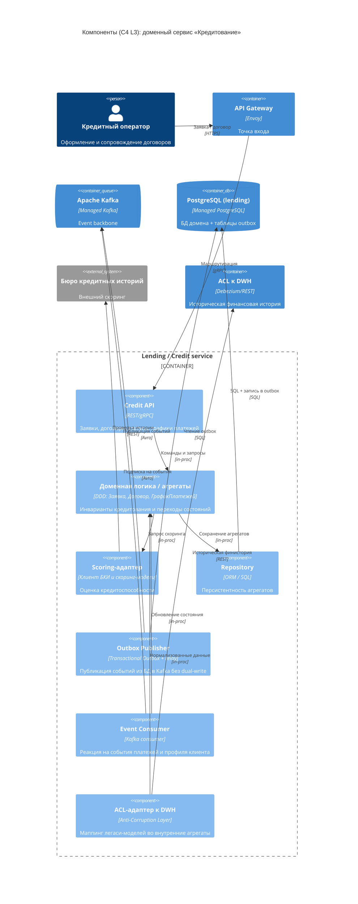
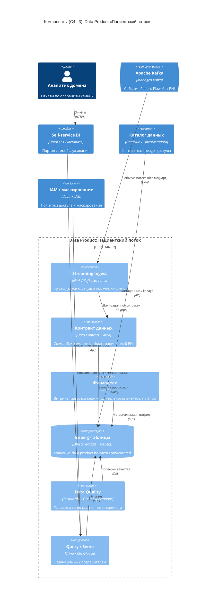

# C4 — Уровень 3. Компоненты (Components)

Детализация двух ключевых контейнеров целевой архитектуры:
1. доменный сервис **«Кредитование» (Lending / Credit)** — типовой доменный
   сервис с outbox, consumer и ACL-адаптером к легаси;
2. **Data Product «Пациентский поток»** — типовой узел Data Mesh.

Оба примера показывают канонические компоненты: API, доменную логику/агрегаты,
outbox-publisher, consumer событий и ACL-адаптер к DWH.

---

## 3.1. Доменный сервис «Кредитование» (Lending / Credit)

### Пояснение компонентов «Кредитование»

| Компонент | Технология | Ответственность |
| --- | --- | --- |
| Credit API | REST/gRPC | Приём команд/запросов: создание заявки, выдача договора, статусы, график. |
| Доменная логика / агрегаты | DDD-модель | Агрегаты `Заявка`, `Договор`, `ГрафикПлатежей`; инварианты и бизнес-правила. |
| Scoring-адаптер | Клиент БКИ | Обращение к внешнему бюро кредитных историй и скоринг-моделям. |
| Repository | ORM/SQL | Загрузка/сохранение агрегатов в PostgreSQL. |
| Outbox Publisher | Transactional Outbox | Публикация доменных событий (`ЗаявкаОдобрена`, `ДоговорВыдан`) — событие пишется в БД в той же транзакции, relay доставляет его в Kafka. |
| Event Consumer | Kafka consumer | Подписка на события домена платежей (`ПлатёжПроведён`) и MDM (`ПрофильОбновлён`) для обновления графика/статуса. |
| ACL-адаптер к DWH | Anti-Corruption Layer | Изолирует легаси-модель MS SQL 2008; переводит историческую финистори­ю во внутренние понятия домена. |

**Почему так.** Outbox исключает рассогласование между БД и Kafka (dual-write).
ACL не даёт легаси-модели «протечь» в доменную логику и позволяет отключить
DWH без переписывания домена. Скоринг вынесен в адаптер — внешние сбои БКИ не
ломают доменные инварианты.

---

## 3.2. Data Product «Пациентский поток» (узел Data Mesh)

### Пояснение компонентов Data Product

| Компонент | Технология | Ответственность |
| --- | --- | --- |
| Streaming Ingest | Flink / Kafka Streams | Приём событий из Kafka, дедупликация, очистка, приведение к контракту. |
| Контракт данных | Data Contract + Avro | Формальная схема, SLA (свежесть/полнота), семантика; **явная фильтрация полей PHI** — медкарты и результаты исследований не попадают в продукт. |
| dbt-модели | dbt | Версионируемые трансформации: слои raw → curated, бизнес-витрины. |
| Iceberg-таблицы | Object Storage + Iceberg | ACID-хранилище data product, схемная эволюция, time travel. |
| Data Quality | Тесты dbt / Great Expectations | Автоматические проверки качества; нарушение SLA блокирует публикацию. |
| Query / Serve | Trino / ClickHouse | Точка потребления для BI-портала и других доменов. |

**Почему так.** Data Product — единица владения в Data Mesh: домен Patient Flow
сам отвечает за качество, контракт и доступность своих данных. Контракт и
фильтрация PHI гарантируют, что запрещённые к аналитике данные (медкарты,
истории болезни, результаты исследований) физически не попадают в витрину.
IAM/Vault обеспечивают доступ и маскирование в рамках прав пользователя.
