# C4 — Уровень 2. Контейнеры (Containers)

Целевые контейнеры платформы **«Будущее 2.0»** в Yandex Cloud (Managed
Kubernetes). Показаны API Gateway, доменные сервисы по каноническим bounded
contexts, событийная шина (Kafka + Schema Registry + DLQ + стриминг), платформа
Data Mesh (lakehouse на Object Storage/Iceberg, движок запросов Trino/ClickHouse,
dbt, каталог), портал self-service BI, Managed PostgreSQL per domain, ACL-мосты
к легаси (DWH и Camel), Vault/IAM и наблюдаемость.

```mermaid
C4Container
    title Контейнеры (C4 L2): целевая платформа «Будущее 2.0»

    Person(patient, "Пациент / клиент банка", "Веб и мобильные каналы")
    Person(doctor, "Врач / оператор клиники", "Рабочее место в клинике")
    Person(analyst, "Аналитик домена", "Self-service отчётность")

    System_Ext(bank_ext, "Внешние банковские системы", "СБП/НСПК, БКИ, платёжные шлюзы")
    System_Ext(partner, "Партнёры фарма/электроника", "Каталог, заказы, телеметрия")
    System_Ext(regulator, "Регуляторы", "ЦБ РФ, Росздравнадзор, Роскомнадзор")

    System_Boundary(future20, "Платформа «Будущее 2.0» — Yandex Cloud, Managed Kubernetes") {

        Container(apigw, "API Gateway", "Yandex API Gateway / Envoy", "Единая точка входа: аутентификация, маршрутизация, rate limiting, mTLS")

        System_Boundary(domains, "Доменные сервисы (bounded contexts)") {
            Container(patientflow, "Patient Flow", "Go/Java", "Регистрация, расписание, визиты")
            Container(ehr, "Medical Records / EHR", "Python/Go", "Медкарты и исследования; изолированный контур PHI, не идёт в аналитику")
            Container(ai, "AI Diagnostics", "Python", "Обработка снимков, инференс моделей, заключения")
            Container(banking, "Banking & Payments", "Go/Java", "Счета, платежи, транзакции")
            Container(lending, "Lending / Credit", "Java", "Кредитные договоры, скоринг")
            Container(billing, "Billing", "Go", "Счета за медуслуги, страховые расчёты")
            Container(hr, "Staff / HR", "Go", "Персонал клиник")
            Container(inventory, "Inventory / Supply Chain", "Go", "Оборудование, фарма, склад")
            Container(mdm, "Customer / Identity / MDM", "Go", "Единый профиль: пациент + клиент банка")
            Container(compliance, "Compliance & Security", "Go", "ПДн, врачебная тайна, согласия, аудит")
            Container(notify, "Notifications", "Go", "Уведомления по событиям")
        }

        ContainerDb(pg, "Managed PostgreSQL (per domain)", "Yandex Managed PostgreSQL", "Своя БД на домен, приватная схема, таблицы outbox")

        System_Boundary(backbone, "Событийная шина (event backbone)") {
            ContainerQueue(kafka, "Apache Kafka", "Yandex Managed Kafka", "Доменные события и реактивные потоки")
            Container(schemareg, "Schema Registry", "Avro / Protobuf", "Каталог схем и контроль совместимости версий")
            ContainerQueue(dlq, "DLQ", "Kafka topics", "Сбойные события, повтор и разбор")
            Container(stream, "Stream Processing", "Kafka Streams / Apache Flink", "Потоковые витрины, обогащение, агрегации")
        }

        System_Boundary(mesh, "Data Mesh платформа") {
            ContainerDb(lake, "Lakehouse", "Object Storage S3 + Apache Iceberg", "Домены-владельцы data products; без медкарт и результатов исследований")
            Container(query, "Query Engine", "Trino / ClickHouse", "Федеративные и быстрые аналитические запросы")
            Container(dbt, "Трансформации", "dbt", "Версионируемые модели data products")
            Container(catalog, "Каталог и governance", "DataHub / OpenMetadata", "Метаданные, происхождение, контракты, доступы")
            Container(bi, "Self-service BI портал", "DataLens / Metabase / Superset", "Конструктор отчётов в рамках прав доступа")
        }

        System_Boundary(platform, "Платформенные сервисы") {
            Container(vault, "Vault / IAM", "HashiCorp Vault + Yandex IAM", "Секреты, ключи, шифрование, маскирование, доступы")
            Container(obs, "Observability", "Prometheus, Grafana, OpenTelemetry, Loki", "Метрики, трейсы, логи, алерты")
        }

        System_Boundary(bridges, "Мосты к легаси (ACL)") {
            Container(acl_dwh, "ACL к DWH", "Debezium CDC + REST", "Антикоррупционный слой к MS SQL 2008")
            Container(acl_camel, "ACL к Camel", "REST/gRPC адаптер", "Антикоррупционный слой к ESB Apache Camel")
        }
    }

    System_Ext(dwh, "Легаси DWH", "MS SQL Server 2008")
    System_Ext(camel, "Легаси ESB", "Apache Camel")

    Rel(patient, apigw, "Запись, оплата", "HTTPS")
    Rel(doctor, apigw, "Приём, расписание", "HTTPS/gRPC")
    Rel(analyst, bi, "Отчёты и дашборды", "HTTPS")

    Rel(apigw, patientflow, "Маршрутизация", "REST/gRPC")
    Rel(apigw, banking, "Маршрутизация", "REST/gRPC")
    Rel(apigw, lending, "Маршрутизация", "REST/gRPC")

    Rel(patientflow, pg, "Чтение/запись + outbox", "SQL")
    Rel(banking, pg, "Чтение/запись + outbox", "SQL")
    Rel(lending, pg, "Чтение/запись + outbox", "SQL")

    Rel(patientflow, kafka, "Публикация событий (outbox)", "Avro")
    Rel(banking, kafka, "Публикация / подписка", "Avro")
    Rel(lending, kafka, "Публикация / подписка", "Avro")
    Rel(notify, kafka, "Подписка на события", "Avro")

    Rel(kafka, schemareg, "Валидация схем", "HTTP")
    Rel(kafka, dlq, "Сбойные сообщения", "Kafka")
    Rel(stream, kafka, "Чтение/запись потоков", "Kafka")

    Rel(stream, lake, "Материализация data products", "Iceberg")
    Rel(query, lake, "Запросы к таблицам", "SQL")
    Rel(dbt, query, "Трансформации моделей", "SQL")
    Rel(bi, query, "Аналитические запросы", "SQL")
    Rel(catalog, lake, "Метаданные / lineage", "API")

    Rel(acl_dwh, dwh, "CDC / JDBC", "Debezium/SQL")
    Rel(acl_camel, camel, "Адаптация вызовов", "REST/gRPC")
    Rel(acl_dwh, kafka, "Нормализованные события", "Avro")
    Rel(acl_camel, kafka, "Нормализованные события", "Avro")

    Rel(banking, bank_ext, "Платежи / транзакции", "ISO 20022/REST")
    Rel(lending, bank_ext, "Скоринг / БКИ", "REST")
    Rel(inventory, partner, "Заказы / каталог", "REST")
    Rel(compliance, regulator, "Отчётность", "SFTP/API")
```

## Таблица: контейнер → технология → ответственность

| Контейнер | Технология (Yandex Cloud) | Ответственность |
| --- | --- | --- |
| API Gateway | Yandex API Gateway / Envoy | Единая точка входа, аутентификация, авторизация, маршрутизация, rate limiting, mTLS. |
| Patient Flow | Go/Java на Managed K8s | Регистрация, расписание, визиты; публикует события потока пациентов. |
| Medical Records / EHR | Python/Go, изолированный контур | Медкарты, истории болезни, результаты исследований. **Не** экспортируется в аналитику. |
| AI Diagnostics | Python, GPU-узлы | Обработка снимков, инференс, заключения; потребляет события EHR/Patient Flow. |
| Banking & Payments | Go/Java | Счета, платежи, транзакции; интеграция с СБП/НСПК. |
| Lending / Credit | Java | Кредитные договоры, скоринг; интеграция с БКИ. |
| Billing | Go | Счета за медуслуги, страховые расчёты. |
| Staff / HR | Go | Персонал клиник, графики, доступы. |
| Inventory / Supply Chain | Go | Оборудование, фарма, склад; интеграция с партнёрами. |
| Customer / Identity / MDM | Go | Единый профиль клиента (пациент + клиент банка), мастер-данные. |
| Compliance & Security | Go | Управление согласиями, ПДн, врачебной тайной, аудитом; регуляторная отчётность. |
| Notifications | Go | Событийные уведомления (push/SMS/email). |
| Managed PostgreSQL (per domain) | Yandex Managed PostgreSQL | Изолированная БД на домен + таблицы outbox для транзакционной публикации. |
| Apache Kafka | Yandex Managed Service for Kafka | Event backbone: доменные события, реактивные потоки. |
| Schema Registry | Avro / Protobuf | Реестр и версионирование схем, контроль обратной совместимости. |
| DLQ | Kafka topics | Изоляция сбойных сообщений, повтор, ручной разбор. |
| Stream Processing | Kafka Streams / Apache Flink | Потоковые витрины, обогащение, near-real-time агрегации. |
| Lakehouse | Object Storage (S3) + Apache Iceberg | Хранение доменных data products (без PHI); ACID-таблицы, time travel. |
| Query Engine | Trino / ClickHouse | Федеративные (Trino) и быстрые интерактивные (ClickHouse) запросы. |
| Трансформации | dbt | Версионируемые, тестируемые модели data products. |
| Каталог и governance | DataHub / OpenMetadata | Каталог, происхождение (lineage), контракты данных, управление доступом. |
| Self-service BI портал | DataLens / Metabase / Superset | Конструктор отчётов и дашбордов; замена кастомного Power BI. |
| Vault / IAM | HashiCorp Vault + Yandex IAM | Секреты, ключи, шифрование, маскирование, RBAC/ABAC. |
| Observability | Prometheus, Grafana, OpenTelemetry, Loki | Метрики, распределённая трассировка, логи, алертинг, SLO. |
| ACL к DWH | Debezium CDC + REST | Антикоррупционный слой к MS SQL 2008: нормализация легаси-моделей в события. |
| ACL к Camel | REST/gRPC адаптер | Антикоррупционный слой к Apache Camel на период миграции. |

## Принципы уровня контейнеров

- **Database per service / per domain.** Никакой общей базы; интеграция —
  только через события (устраняется жёсткая связанность через DWH).
- **Transactional Outbox.** Событие и изменение состояния фиксируются в одной
  транзакции PostgreSQL; отдельный publisher доставляет событие в Kafka
  (защита от dual-write).
- **Schema-first.** Все события описаны схемами в Schema Registry с политикой
  совместимости; несовместимые изменения блокируются в CI.
- **Изоляция PHI.** Контур EHR/AI Diagnostics сетево отделён; в Data Mesh
  попадают только разрешённые доменные события (без медкарт и исследований).
- **Мосты, а не зависимость.** Легаси интегрируется исключительно через ACL,
  чтобы легаси-модель не «протекала» в целевые домены и легко отключалась.
