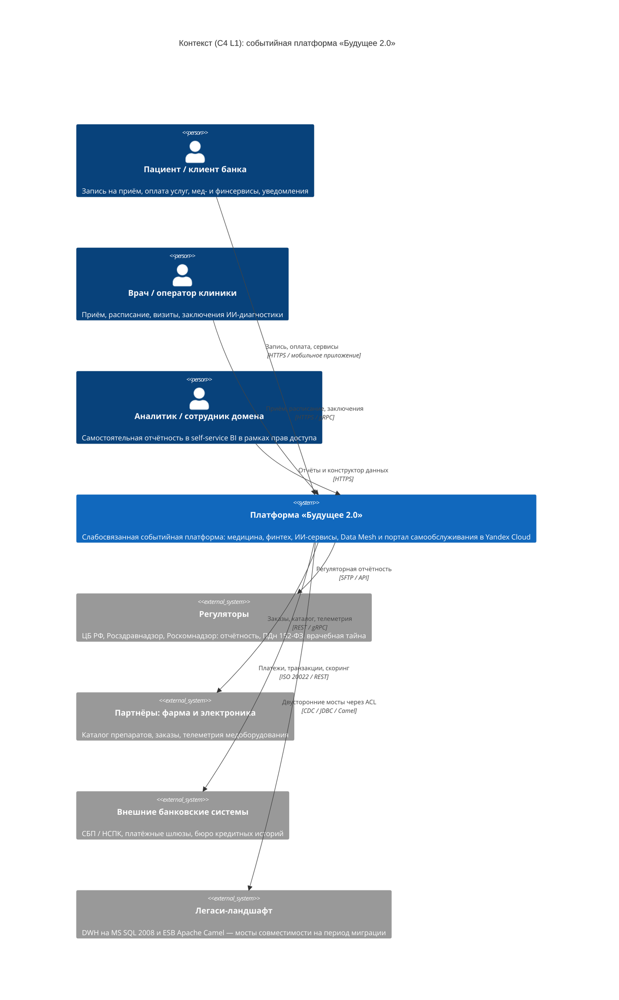

# C4 — Уровень 1. Системный контекст (System Context)

Целевая архитектура компании **«Будущее 2.0»** в горизонте трёх лет.
Диаграмма показывает платформу как единую систему и её внешних акторов:
пациентов и клиентов банка, врачей и операторов клиник, бизнес-аналитиков
доменов, регуляторов, партнёров (фарма и электроника), внешние банковские
системы, а также легаси-ландшафт (DWH и Apache Camel), который на время
миграции сохраняется исключительно как «мост совместимости».

## Пояснение к акторам и границам

| Актор / система | Тип | Роль в контексте |
| --- | --- | --- |
| Пациент / клиент банка | Person | Потребитель мед- и финуслуг; един в MDM (единый профиль). |
| Врач / оператор клиники | Person | Операционная работа: приём, расписание, заключения. Заменяет клиента на PowerBuilder. |
| Аналитик домена | Person | Self-service аналитика вместо кастомного Power BI. |
| Платформа «Будущее 2.0» | System | Целевая событийная платформа (домены + Data Mesh + BI-портал). |
| Регуляторы | Ext | ЦБ РФ (банковская лицензия), Росздравнадзор, Роскомнадзор (ПДн, врачебная тайна). |
| Партнёры фарма/электроника | Ext | Новые бизнес-направления: поставки, каталог, телеметрия оборудования. |
| Внешние банковские системы | Ext | СБП/НСПК, платёжные шлюзы, БКИ для скоринга. |
| Легаси-ландшафт | Ext | DWH (MS SQL 2008) и Camel; на диаграмме вынесены как внешние, поскольку в целевом состоянии подлежат выводу. |

## Ключевые принципы контекста

- **Событийное взаимодействие.** Внутри платформы домены общаются через события
  и реактивные потоки, а не через общий монолитный DWH.
- **Изоляция чувствительных данных.** Медкарты, истории болезни и результаты
  исследований (домен Medical Records / EHR) не выходят в аналитическую витрину.
  Медицинский контур сетево изолирован.
- **Легаси как временный мост.** DWH и Camel доступны только через
  антикоррупционные слои (ACL) и выводятся из эксплуатации к концу Этапа 3.
- **Масштабирование по трём осям.** Новые продукты (финтех/медицина/ИИ), новая
  география (2–3 региона), рост числа источников и переход от batch к
  near-real-time.
