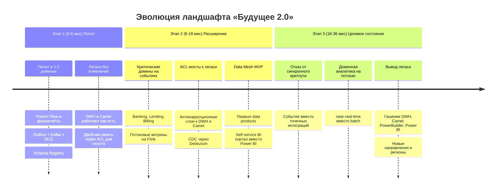
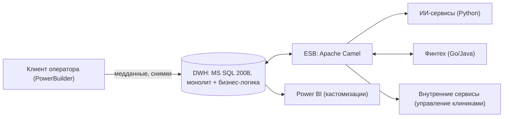
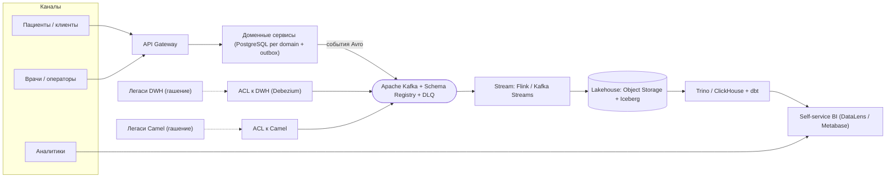
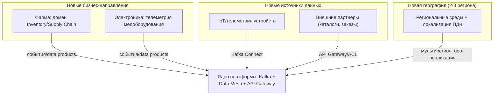

# Эволюция ключевых систем при масштабировании (миграция AS-IS → TO-BE)

Документ показывает, как меняются ключевые системы «Будущее 2.0» по мере
масштабирования: появление новых бизнес-направлений (фарма, электроника, новые
регионы), интеграция дополнительных источников данных и постепенный отказ от
легаси (DWH на MS SQL 2008, ESB на Camel, клиент на PowerBuilder, кастомный
Power BI). Эволюция разбита на три этапа трансформации.

## Хронология трансформации (3 этапа)

## Состояние «до» (AS-IS)

Жёстко связанный ландшафт: монолитный DWH с бизнес-логикой в центре, всё идёт
через него и через ESB Camel.

**Проблемы AS-IS:** бизнес-логика заперта в DWH; отчёты формируются часами;
жёсткая связанность через DWH и Camel; медленный time-to-market; невозможно
независимо развивать домены.

## Состояние «после» (TO-BE)

Слабосвязанная событийная платформа: домены автономны, интеграция через Kafka,
аналитика — Data Mesh, легаси доступно только через ACL и гасится.

## Как меняются ключевые системы: до / после

| Система (AS-IS) | Проблема | Целевое (TO-BE) | Этап вывода |
| --- | --- | --- | --- |
| DWH (MS SQL 2008) | Монолит, бизнес-логика внутри, отчёты часами | Доменные сервисы + Data Mesh; DWH как ACL-мост (CDC), затем гашение | Этап 2 — ACL, Этап 3 — вывод |
| ESB (Apache Camel) | Жёсткая связанность, точечные синхронные интеграции | Kafka event backbone; Camel как ACL-мост, затем отказ | Этап 2 — ACL, Этап 3 — вывод |
| Клиент на PowerBuilder | Тяжёлый десктоп, привязка к DWH | Веб/мобильные каналы через API Gateway к доменным сервисам | Этап 2–3 |
| Power BI (кастомизации) | Кастомизации поверх DWH, не масштабируется | Self-service BI портал (DataLens/Metabase) поверх Data Mesh | Этап 2 — MVP, Этап 3 — полный переход |
| Аналитика (batch) | Формируется часами, тяжёлые трансформации | Потоковые витрины (Flink) + lakehouse (Iceberg), near-real-time | Этап 2–3 |
| Финтех (Go/Java) | Интеграция через Camel/DWH | Доменные сервисы Banking/Lending/Billing на событиях | Этап 1–2 |
| ИИ-сервисы (Python) | Данные через ESB | Домен AI Diagnostics, подписка на события EHR/Patient Flow | Этап 2–3 |

## Масштабирование: новые направления, источники, регионы

**Ключевая идея масштабирования.** Новое направление или источник подключается
как ещё один домен/data product и производитель событий — без внесения
бизнес-логики в DWH. Новый регион разворачивается как отдельная среда (см.
модульную инфраструктуру Task1) с учётом локальных требований ПДн; события и
data products остаются контрактными и переносимыми.

## Принципы миграции

- **Strangler Fig.** Легаси не переписывается разом: домены выносятся по одному,
  трафик переключается постепенно, DWH/Camel обёрнуты ACL и гасятся последними.
- **ACL как предохранитель.** Легаси-модель не проникает в целевые домены;
  отключение легаси не требует переписывания доменной логики.
- **Обратная совместимость данных.** CDC (Debezium) с DWH и параллельная работа
  старых/новых витрин до подтверждения паритета отчётности.
- **Порядок вывода.** Сначала уходят синхронные интеграции на критическом пути
  (Этап 3), затем batch-аналитика Power BI, в конце — сам DWH.
