# План управления рисками трансформации «Будущее 2.0»

По каждому риску из [`risk-map.md`](risk-map.md) описаны меры снижения, владелец,
стратегия реагирования (`mitigate` — снижать, `avoid` — избегать,
`transfer` — передавать, `accept` — принять), индикаторы (метрики раннего
предупреждения) и привязка к этапам трансформации.

Стратегии обработки риска:
- **mitigate** — снизить вероятность/влияние мерами;
- **avoid** — устранить причину/изменить решение;
- **transfer** — передать риск (страхование, аутсорс, SLA вендора);
- **accept** — осознанно принять с мониторингом.

## Сводная таблица управления рисками

| ID | Стратегия | Ключевые меры снижения | Владелец | Индикаторы | Этап |
| --- | --- | --- | --- | --- | --- |
| R01 dual-write | mitigate | Transactional Outbox + idempotent consumers; exactly-once где возможно | Ведущий архитектор | Число рассогласований, дубли/потери событий | Этап 1 |
| R02 утечка PHI | avoid | Изоляция контура EHR; data contracts с фильтрацией PHI; маскирование; DLP-проверки | CISO / DPO | Инциденты доступа к PHI, срабатывания DLP | Этап 1–3 |
| R03 легаси на критпути | mitigate | Roadmap вывода легаси с датами; ACL; strangler fig; запрет новой логики в DWH | CTO / Программный офис | Доля трафика на легаси, число зависимостей от DWH | Этап 2–3 |
| R04 эволюция схем | mitigate | Schema Registry + политика совместимости; проверка схем в CI; версионирование | Платформенная команда | Отклонённые несовместимые схемы, поломки консьюмеров | Этап 1 |
| R05 саги/согласованность | mitigate | Saga/Process Manager; компенсации; идемпотентность; сверки | Архитектор доменов | Число незавершённых саг, расхождения сверок | Этап 2 |
| R06 data-болото | mitigate | Каталог (DataHub), data contracts, тесты качества, назначенные владельцы | Data Platform Lead | Доля продуктов с контрактом и SLA, провалы качества | Этап 2–3 |
| R07 Kafka узкое место | mitigate | Партиционирование, квоты, автоскейлинг, мониторинг lag, DLQ, tiered storage | Платформенная команда | Consumer lag, глубина DLQ, throughput/latency | Этап 1–2 |
| R08 vendor lock-in | accept / mitigate | Открытые стандарты (Kafka, Iceberg, PostgreSQL, S3-API); IaC; exit-план | Enterprise-архитектор | Доля проприетарных зависимостей, оценка миграции | Этап 2–3 |
| R09 миграция ТБ | mitigate | Поэтапная миграция, CDC, параллельный прогон, сверка, окна и откат | Data Platform Lead | Прогресс миграции, ошибки целостности, простои | Этап 2 |
| R10 SLA near-real-time | mitigate | Нагрузочное тестирование, capacity planning, кэш/материализация, SLO | Платформенная команда | p95/p99 latency, нарушения SLO | Этап 2–3 |
| R11 безопасность/IAM | mitigate / transfer | Vault, ротация секретов, mTLS, сетевая сегментация, пентесты, страхование киберрисков | CISO | Инциденты ИБ, покрытие сканами, срок ротации | Этап 1–3 |
| R12 наблюдаемость | mitigate | OpenTelemetry сквозная трассировка, SLO-дашборды, алерты, on-call | SRE / Платформа | MTTR, MTTD, покрытие трассировкой | Этап 1–2 |
| R13 дефицит компетенций | mitigate | Обучение, найм, партнёр-интегратор, парное программирование, снятие bus factor | HR / CTO | Заполненность ролей, bus factor, текучесть | Этап 1–2 |
| R14 сопротивление изменениям | mitigate | Change management, коммуникация ценности, «маяки», вовлечение доменов | COO / Программный офис | Adoption BI-портала, доля активных доменов | Этап 1–3 |
| R15 ownership доменов | mitigate | Модель data ownership, RACI, доменные команды, governance-совет | Enterprise-архитектор | Доля продуктов с владельцем, спорные зоны | Этап 2 |
| R16 регуляторы/регионы | avoid / transfer | Ранний комплаенс-ассессмент, локализация ПДн, юр-сопровождение, поэтапный вход | Compliance / Legal | Статус согласований, замечания регуляторов | Этап 2–3 |
| R17 бюджет и сроки | mitigate | Поэтапное финансирование по этапам, контроль двойных затрат, KPI выгод | CFO / Программный офис | Отклонение бюджета/сроков, срок вывода легаси | Этап 1–3 |

## Риски, закрываемые ТЕХНИЧЕСКИМИ решениями

Снижаются преимущественно инженерными механизмами платформы:

| ID | Техническое решение |
| --- | --- |
| R01 | Transactional Outbox, идемпотентные консьюмеры, exactly-once semantics. |
| R02 | Сетевая изоляция контура EHR, data contracts с фильтрацией PHI, маскирование, DLP. |
| R04 | Schema Registry, контроль совместимости схем в CI/CD, версионирование Avro/Protobuf. |
| R05 | Оркестрация саг/Process Manager, компенсирующие транзакции, идемпотентность, автосверки. |
| R06 | Каталог данных, автоматические тесты качества (dbt/Great Expectations), lineage. |
| R07 | Партиционирование, автоскейлинг, квоты, DLQ, tiered storage, мониторинг lag. |
| R09 | CDC (Debezium), инкрементальная миграция, параллельный прогон, автоматическая сверка. |
| R10 | Нагрузочное тестирование, материализация витрин, кэширование, capacity planning. |
| R11 | Vault, mTLS, ротация секретов, сетевая сегментация, шифрование, автоскан уязвимостей. |
| R12 | OpenTelemetry, Prometheus/Grafana/Loki, сквозная трассировка, SLO-алерты. |

## Риски, закрываемые УПРАВЛЕНЧЕСКИМИ подходами

Снижаются организационными, процессными и договорными мерами:

| ID | Управленческий подход |
| --- | --- |
| R03 | Программный офис, дорожная карта вывода легаси с датами, архитектурный контроль (запрет новой логики в DWH). |
| R08 | Стратегия на открытые стандарты, exit-план, договорные условия с вендором. |
| R13 | Программа обучения и найма, партнёрство с интегратором, устранение bus factor. |
| R14 | Change management, коммуникация ценности, вовлечение доменов, быстрые «маяки». |
| R15 | Модель data ownership, RACI, governance-совет, доменные команды. |
| R16 | Ранний комплаенс-ассессмент, юридическое сопровождение, поэтапный вход в регионы. |
| R17 | Поэтапное финансирование, контроль двойных затрат, KPI бизнес-выгод. |

> Ряд рисков закрывается **комбинированно**: R02 и R11 требуют и технических
> мер (изоляция, шифрование, DLP), и управленческих (политики ИБ, DPO, аудит);
> R08 сочетает открытые стандарты (техника) и exit-план (управление).

## Привязка к этапам трансформации

```mermaid
flowchart LR
    subgraph s1["Этап 1 (0-6 мес) Пилот"]
        a1["R01 Outbox"]
        a2["R04 Schema Registry"]
        a3["R07 DLQ и мониторинг lag"]
        a4["R13 обучение и найм"]
    end
    subgraph s2["Этап 2 (6-18 мес) Расширение"]
        b1["R03 ACL и вывод легаси"]
        b2["R05 саги"]
        b3["R06 контракты и качество данных"]
        b4["R09 миграция DWH"]
        b5["R15 data ownership"]
        b6["R16 комплаенс регионов"]
    end
    subgraph s3["Этап 3 (18-36 мес) Целевое состояние"]
        c1["R03 гашение легаси"]
        c2["R10 SLA near-real-time"]
        c3["R14 полный переход на BI-портал"]
    end
    s1 --> s2 --> s3
```

## Ключевые метрики программы (сводно)

| Метрика | Смысл | Целевой ориентир |
| --- | --- | --- |
| Consumer lag / глубина DLQ | Здоровье событийной шины | В пределах SLO, DLQ разбирается |
| Доля трафика на легаси | Прогресс вывода DWH/Camel | → 0 к концу Этапа 3 |
| Инциденты доступа к PHI | Соблюдение изоляции медданных | 0 |
| p95/p99 latency аналитики | Соблюдение SLA near-real-time | В рамках SLO |
| Adoption self-service BI | Отказ от Power BI | Рост до целевого охвата доменов |
| Отклонение бюджета/сроков | Управляемость программы | В пределах допустимого коридора |
