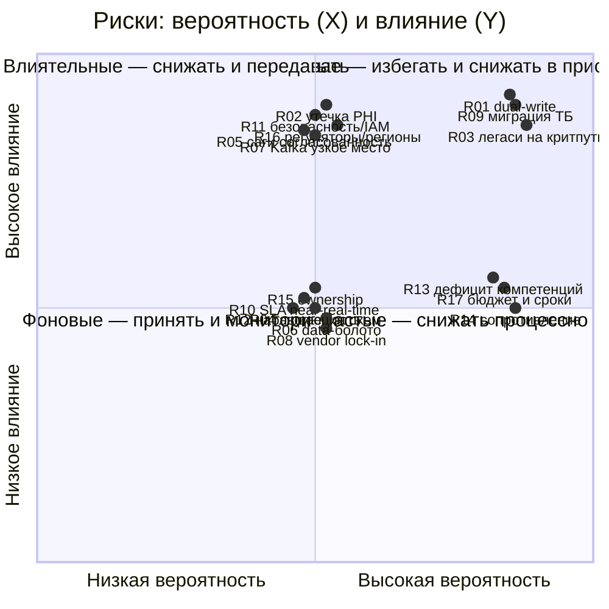

# Карта рисков трансформации «Будущее 2.0»

Риски трансформации сгруппированы по трём категориям: **Архитектурные**,
**Технологические**, **Организационные**. Для каждого риска указаны вероятность
и влияние, уровень рассчитывается как произведение баллов.

## Методика расчёта уровня

Вероятность: `низкая = 1`, `средняя = 2`, `высокая = 3`.
Влияние: `низкое = 1`, `среднее = 2`, `высокое = 3`.
Уровень = Вероятность × Влияние:

| Балл (P×I) | Уровень |
| --- | --- |
| 1–2 | Низкий |
| 3–4 | Средний |
| 6–9 | Высокий |

## Реестр рисков

| ID | Риск | Категория | Вероятность | Влияние | Балл | Уровень |
| --- | --- | --- | --- | --- | --- | --- |
| R01 | Дуальная запись (dual-write): рассогласование и потеря/дубли событий между БД домена и Kafka без outbox | Архитектурный | высокая | высокое | 9 | Высокий |
| R02 | Утечка PHI (медкарты, истории болезни, результаты исследований) в аналитическую витрину вопреки запрету | Архитектурный | средняя | высокое | 6 | Высокий |
| R03 | Легаси DWH/Camel остаются «мостами» дольше плана; критический путь зависит от MS SQL 2008 | Архитектурный | высокая | высокое | 9 | Высокий |
| R04 | Несовместимая эволюция схем событий ломает потребителей (нет контроля версий Avro/Protobuf) | Архитектурный | средняя | среднее | 4 | Средний |
| R05 | Распределённая согласованность: сложные транзакции (платёж + биллинг + кредит) дают рассогласование без саг | Архитектурный | средняя | высокое | 6 | Высокий |
| R06 | Data Mesh деградирует в «озеро-болото»: низкое качество data products, дубли, нет владения | Архитектурный | средняя | среднее | 4 | Средний |
| R07 | Kafka как узкое место/точка отказа: перегрузка, рост DLQ, отставание консьюмеров (lag) | Технологический | средняя | высокое | 6 | Высокий |
| R08 | Vendor lock-in Yandex Cloud (managed Kafka/PostgreSQL/ClickHouse): риск переносимости и цены | Технологический | средняя | среднее | 4 | Средний |
| R09 | Миграция сотен ТБ из MS SQL 2008: длительность, риск целостности, окна простоя | Технологический | высокая | высокое | 9 | Высокий |
| R10 | Near-real-time аналитика (Flink/Trino/ClickHouse) не выдерживает SLA под ростом нагрузки | Технологический | средняя | среднее | 4 | Средний |
| R11 | Компрометация секретов/IAM, недостаточная сетевая изоляция медицинского контура | Технологический | средняя | высокое | 6 | Высокий |
| R12 | Незрелая наблюдаемость: нет сквозной трассировки, инциденты диагностируются медленно | Технологический | средняя | среднее | 4 | Средний |
| R13 | Дефицит компетенций (Kafka, Flink, Data Mesh, dbt) и зависимость от ключевых людей | Организационный | высокая | среднее | 6 | Высокий |
| R14 | Сопротивление изменениям; параллельная поддержка легаси (PowerBuilder/Power BI) распыляет команды | Организационный | высокая | среднее | 6 | Высокий |
| R15 | Размытая ответственность за домены/data products (нет data ownership, конфликт офиса и доменов) | Организационный | средняя | среднее | 4 | Средний |
| R16 | Регуляторные задержки/несоответствие (лицензия банка, врачебная тайна, локализация ПДн 152-ФЗ) при выходе в регионы | Организационный | средняя | высокое | 6 | Высокий |
| R17 | Перерасход бюджета/сроков 3-летней программы; двойные затраты на облако + легаси | Организационный | высокая | среднее | 6 | Высокий |

**Итого:** 17 рисков — Высоких: 11, Средних: 6, Низких: 0.

## Матрица «вероятность × влияние» (quadrant)

## Матрица уровней (табличная форма)

| Вероятность \ Влияние | Низкое | Среднее | Высокое |
| --- | --- | --- | --- |
| **Высокая** | — | R13, R14, R17 (Высокий) | R01, R03, R09 (Высокий) |
| **Средняя** | — | R04, R06, R08, R10, R12, R15 (Средний) | R02, R05, R07, R11, R16 (Высокий) |
| **Низкая** | — | — | — |

## Тепловая карта по категориям

| Категория | Кол-во | Высокие | Средние |
| --- | --- | --- | --- |
| Архитектурные | 6 (R01–R06) | R01, R02, R03, R05 | R04, R06 |
| Технологические | 6 (R07–R12) | R07, R09, R11 | R08, R10, R12 |
| Организационные | 5 (R13–R17) | R13, R14, R16, R17 | R15 |

Меры по снижению, распределение на технические и управленческие, владельцы,
стратегии и индикаторы — в [`risk-management-plan.md`](risk-management-plan.md).
