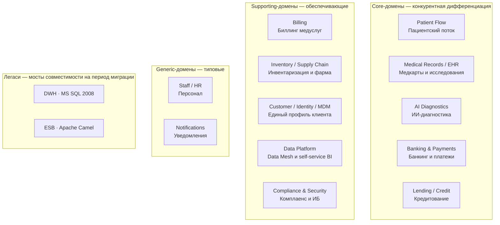
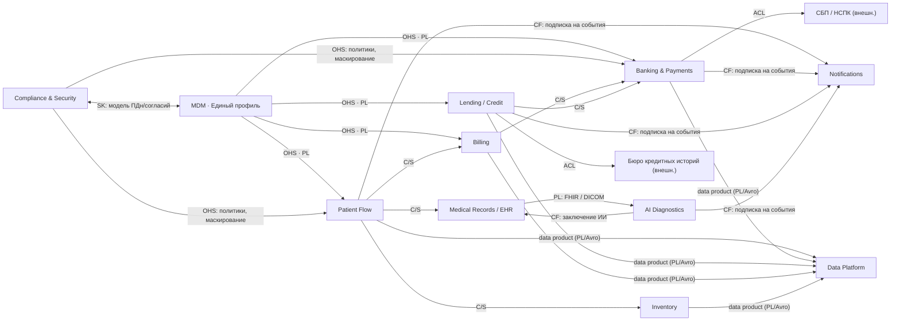
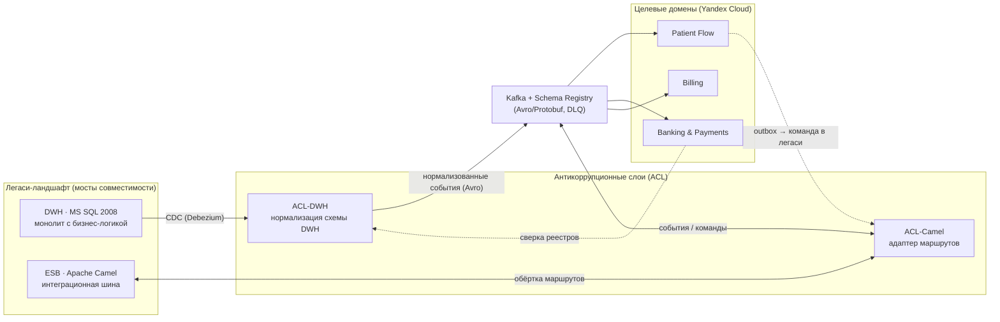

# Bounded Contexts и Context Map — «Будущее 2.0»

Документ разбивает целевую платформу на **ограниченные контексты (bounded
contexts)** по методологии Domain-Driven Design, классифицирует каждый домен
как **core / supporting / generic** и описывает **карту контекстов (Context
Map)** с паттернами взаимодействия: Customer/Supplier, Conformist,
Anticorruption Layer (ACL), Open Host Service (OHS), Published Language,
Shared Kernel.

Отдельно показан **антикоррупционный слой (ACL)** к легаси-ландшафту
(DWH на MS SQL 2008 и ESB Apache Camel), который на период миграции остаётся
только «мостом совместимости» и выводится из эксплуатации по стратегии
*strangler-fig*.

---

## 1. Таблица доменов (bounded contexts)

| # | Домен / Bounded Context | Тип | Ubiquitous language (ключевые понятия) | Обоснование типа | Целевой стек |
| --- | --- | --- | --- | --- | --- |
| 1 | **Patient Flow** — пациентский поток | **Core** | Пациент, Запись, Приём, Расписание, Визит | Операционное ядро клиник, прямой драйвер выручки и клиентского опыта | Go/Java, PostgreSQL, Kafka |
| 2 | **Medical Records / EHR** — медкарты и исследования | **Core** | Медкарта, История болезни, Эпизод, Исследование, Заключение | Уникальный клинический актив; жёсткая изоляция PHI, **не идёт в аналитику** | Java, PostgreSQL, S3 (снимки), FHIR/DICOM |
| 3 | **AI Diagnostics** — ИИ-диагностика | **Core** | Снимок, Модель, Инференс, Заключение ИИ, Уверенность | Ключевая конкурентная дифференциация компании | Python, Kubernetes GPU, S3, Kafka |
| 4 | **Banking & Payments** — банкинг и платежи | **Core** | Счёт, Платёж, Транзакция, Проводка, Реестр | Лицензированный банк; критичный путь денег, near-real-time | Go/Java, PostgreSQL, Kafka |
| 5 | **Lending / Credit** — кредитование | **Core** | Заявка, Скоринг, Кредитный договор, График, Транш | Продуктовая дифференциация финтеха, монетизация | Java, PostgreSQL, Kafka |
| 6 | **Billing** — биллинг медуслуг | Supporting | Счёт за услугу, Тариф, Страховое покрытие, Акт | Обеспечивает выручку клиник, но не уникальный know-how | Go, PostgreSQL, Kafka |
| 7 | **Inventory / Supply Chain** — инвентаризация и фарма | Supporting | Позиция, Партия, Списание, Заказ поставщику, Оборудование | Поддерживает операции клиник; частично типовые процессы | Go, PostgreSQL, Kafka |
| 8 | **Customer / Identity / MDM** — единый профиль | Supporting | Клиент, Пациент, Идентификатор, Golden record, Согласие | Стратегический связующий домен (пациент + клиент банка) | Java, PostgreSQL, Kafka, MDM-движок |
| 9 | **Data Platform / Analytics** — Data Mesh, self-service BI | Supporting | Data product, Витрина, Датасет, Контракт данных, Каталог | Платформа-энейблер: масштабирует аналитику без ETL в DWH | ClickHouse, Iceberg/S3, Trino, dbt, DataLens |
| 10 | **Compliance & Security** — комплаенс и ИБ | Supporting | ПДн, Врачебная тайна, Согласие, Классификация, Маскирование | Сквозной регуляторный контроль (152-ФЗ, ЦБ РФ, PHI/PII) | Vault, IAM, policy-as-code |
| 11 | **Staff / HR** — персонал больницы | Generic | Сотрудник, Роль, График смен, Компетенция | Типовой процесс, кандидат на коробочное решение/SaaS | коробочный HRM + интеграция |
| 12 | **Notifications** — уведомления | Generic | Шаблон, Канал, Подписка, Доставка | Инфраструктурный сервис рассылок, легко унифицируется | Go, Kafka, SMS/Push/E-mail шлюзы |

> **Легенда типов.** *Core* — конкурентная дифференциация, максимум инвестиций
> и собственной разработки. *Supporting* — обеспечивает core, разрабатывается
> под себя, но без уникального know-how. *Generic* — типовая функция, где
> предпочтителен готовый продукт.

---

## 2. Ландшафт доменов по типам

---

## 3. Context Map с паттернами взаимодействия

На карте показаны направления **upstream → downstream** и применяемые паттерны.
Обозначения: **C/S** — Customer/Supplier, **CF** — Conformist, **ACL** —
Anticorruption Layer, **OHS** — Open Host Service, **PL** — Published Language,
**SK** — Shared Kernel.

> **Важно про изоляцию PHI.** Домены **Medical Records / EHR** и **AI
> Diagnostics** сознательно **не связаны** с **Data Platform**: медкарты,
> истории болезни и результаты исследований не выгружаются в аналитическую
> витрину. В аналитику попадают только обезличенные операционные и финансовые
> data products.

---

## 4. Таблица связей Context Map

| Upstream (Supplier) | Downstream (Customer) | Паттерн | Что передаётся / смысл интеграции |
| --- | --- | --- | --- |
| MDM | Patient Flow, Banking, Lending, Billing | **OHS + Published Language** | Golden record клиента/пациента, единый идентификатор; публикуется как стабильный API + Avro-события |
| Compliance & Security | Patient Flow, Banking, Billing, … | **OHS** | Решения политик, проверка согласий, правила маскирования (policy-as-code) |
| Compliance & Security ↔ MDM | (двусторонне) | **Shared Kernel** | Совместно сопровождаемая модель ПДн, классификации PII/PHI и согласий |
| Patient Flow | Medical Records / EHR | **Customer/Supplier** | Визит открывает клинический эпизод; EHR — потребитель событий визита |
| Patient Flow | Billing | **Customer/Supplier** | «Визит завершён» → формирование счёта за услугу |
| Patient Flow | Inventory | **Customer/Supplier** | Списание расходников/препаратов по факту приёма |
| Medical Records / EHR | AI Diagnostics | **Published Language (FHIR/DICOM)** | Снимки и направления передаются в стандартизованном формате |
| AI Diagnostics | Medical Records / EHR | **Conformist** | Заключение ИИ возвращается в карту в модели EHR |
| Billing | Banking & Payments | **Customer/Supplier** | Запрос на оплату выставленного счёта |
| Lending / Credit | Banking & Payments | **Customer/Supplier** | Выдача транша, списания по графику через счёт |
| Lending / Credit | Бюро кредитных историй | **ACL** | Изоляция от внешней модели БКИ при скоринге |
| Banking & Payments | СБП / НСПК | **ACL** | Изоляция от внешних платёжных протоколов (ISO 20022 / СБП) |
| Все доменные data products | Data Platform | **Conformist + Published Language** | Домены публикуют контракты данных; платформа конформна к ним |
| Операционные домены | Notifications | **Conformist** | Подписка на доменные события для рассылок |
| Legacy DWH | Целевые домены | **ACL (ACL-DWH)** | CDC из DWH нормализуется в доменные события |
| Legacy Camel | Целевые домены | **ACL (ACL-Camel)** | Маршруты Camel оборачиваются адаптером в события/команды |

---

## 5. Антикоррупционный слой к легаси (DWH / Camel)

Легаси не проникает в модель новых доменов напрямую: между ними стоит
**ACL**, который транслирует форматы и защищает целевые контексты от
монолитной модели DWH и особенностей маршрутов Camel. Это опора миграции
по стратегии **strangler-fig**: новые домены постепенно перехватывают функции,
а легаси-мосты отключаются по мере готовности.

**Как это работает по этапам трансформации:**

- **Этап 1 (0–6 мес).** Пилот (пациентский поток / финрасчёты) публикует
  события в Kafka; ACL читает из DWH через CDC, чтобы новые домены видели
  исторические данные без прямого доступа к таблицам.
- **Этап 2 (6–18 мес).** ACL-Camel оборачивает существующие маршруты: новые
  домены обмениваются событиями, а обращения к легаси идут только через
  адаптер. Появляются потоковые витрины поверх событий.
- **Этап 3 (18–36 мес).** Синхронные точечные интеграции на критическом пути
  отключаются; ACL-мосты гасятся домен за доменом, DWH и Camel выводятся из
  эксплуатации.

---

## 6. Глоссарий паттернов Context Map

| Паттерн | Когда применяем в «Будущее 2.0» |
| --- | --- |
| **Customer/Supplier** | Downstream-домен зависит от upstream, но влияет на его бэклог (Billing ← Patient Flow). Приоритеты согласуются между командами. |
| **Conformist** | Downstream принимает модель upstream без трансляции (Notifications, Data Platform — потребляют события «как есть»). |
| **Anticorruption Layer (ACL)** | Защита от чужой/легаси-модели: DWH, Camel, БКИ, СБП. Трансляция во внутренние понятия домена. |
| **Open Host Service (OHS)** | Домен предоставляет стабильный опубликованный API/поток для многих потребителей (MDM, Compliance, Payments). |
| **Published Language** | Общий документированный формат обмена: Avro/Protobuf-схемы в Schema Registry; FHIR/DICOM в клиническом контуре. |
| **Shared Kernel** | Малая совместно сопровождаемая модель между двумя командами (Compliance ↔ MDM: классификация ПДн и согласия). Применяем ограниченно из-за связности. |

---

## 7. Ключевые принципы разбиения

- **Границы = язык + владелец данных.** Каждый контекст владеет своей
  ubiquitous language и своей БД; чужие домены не ходят в его таблицы.
- **Core защищаем инвестициями, generic — покупаем.** ИИ-диагностика, EHR,
  кредитование и платежи — собственная разработка; HR и уведомления — готовые
  решения за фасадом.
- **Интеграция через события, а не через общую БД.** Обмен идёт публикацией
  доменных событий (Published Language), а не запросами в чужую схему.
- **Изоляция чувствительного контура.** EHR и AI Diagnostics отделены сетево и
  по данным; их содержимое не попадает в аналитику.
- **Легаси только за ACL.** Ни один целевой домен не связан с DWH/Camel
  напрямую — исключительно через антикоррупционные слои.
