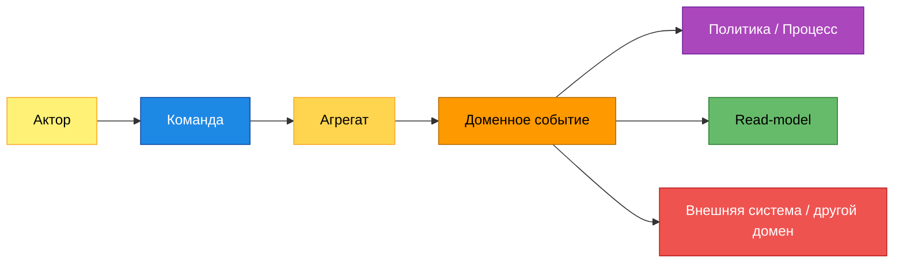
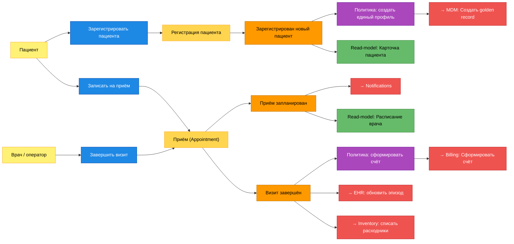
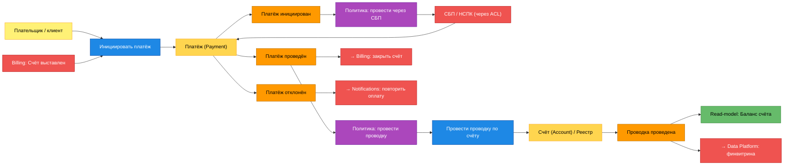
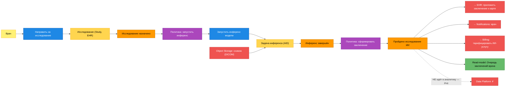
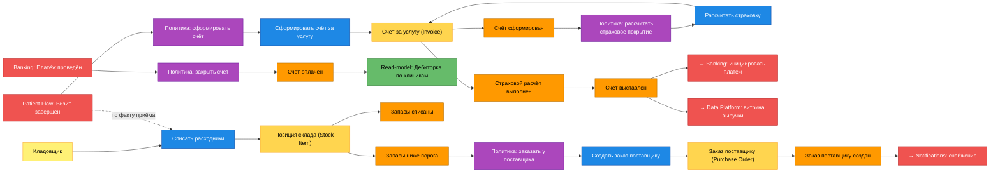

# Event Storming — целевая событийная архитектура «Будущее 2.0»

Диаграммы построены по нотации **Event Storming**. Для каждого ключевого
потока показаны: **акторы**, **команды**, **агрегаты**, **доменные события**
(оранжевые), **политики/процессы** (реагируют на события и порождают новые
команды), **read-models** и переходы событий к **доменам-подписчикам**.

Для каждого события в разделах ниже и в каталоге [`events.md`](./events.md)
указаны **источник** и **подписчики**.

---

## Легенда (цветовая нотация)

| Цвет | Элемент | Значение |
| --- | --- | --- |
| Жёлтый (светлый) | Актор | Кто инициирует команду (человек или система) |
| Синий | Команда | Намерение изменить состояние (imperative) |
| Жёлтый (насыщенный) | Агрегат | Граница согласованности, обрабатывает команду |
| **Оранжевый** | **Доменное событие** | Факт, произошедший в прошлом (past tense) |
| Фиолетовый | Политика / Процесс | Реакция «когда произошло X → сделать Y» |
| Зелёный | Read-model | Проекция для запросов/UI/отчётов |
| Красный | Внешняя система / другой домен | Подписчик или внешний интегратор |

---

## Поток 1. Пациентский поток (Patient Flow)

**Ключевые события потока:** `Зарегистрирован новый пациент` (источник Patient
Flow → подписчики MDM, Billing, Data Platform), `Приём запланирован` (→
Notifications, HR, Data Platform), `Визит завершён` (→ Billing, EHR, Inventory,
Data Platform).

---

## Поток 2. Кредитование (Lending / Credit)

```mermaid
flowchart LR
  classDef actor fill:#FFF176,stroke:#F9A825,color:#000;
  classDef command fill:#1E88E5,stroke:#0D47A1,color:#fff;
  classDef aggregate fill:#FFD54F,stroke:#F9A825,color:#000;
  classDef event fill:#FF9900,stroke:#B36B00,color:#000;
  classDef policy fill:#AB47BC,stroke:#6A1B9A,color:#fff;
  classDef readmodel fill:#66BB6A,stroke:#2E7D32,color:#000;
  classDef external fill:#EF5350,stroke:#B71C1C,color:#fff;

  A1["Клиент банка"]:::actor --> C1["Подать заявку на кредит"]:::command
  C1 --> AG1["Заявка на кредит"]:::aggregate
  AG1 --> E1["Заявка на кредит подана"]:::event
  E1 --> P1["Политика: запустить скоринг"]:::policy
  P1 --> C2["Выполнить скоринг"]:::command
  C2 --> AG2["Кредитный скоринг"]:::aggregate
  XBKI["Бюро кредитных историй (через ACL)"]:::external --> AG2
  XMDM["MDM: профиль клиента"]:::external --> AG2
  AG2 --> E2["Скоринг выполнен"]:::event
  E2 --> P2["Политика: принять решение"]:::policy
  P2 --> E3["Решение по кредиту принято"]:::event
  E3 --> P3["Политика: оформить договор"]:::policy
  P3 --> C3["Создать кредитный договор"]:::command
  C3 --> AG3["Кредитный договор"]:::aggregate
  AG3 --> E4["Создан кредитный договор"]:::event
  E4 --> XBP["→ Banking: выдать транш"]:::external
  E4 --> XN["→ Notifications: клиент"]:::external
  E4 --> XDP["→ Data Platform: витрина кредитов"]:::external
  E4 --> RM1["Read-model: График платежей"]:::readmodel
```

**Ключевые события потока:** `Заявка на кредит подана`, `Скоринг выполнен`,
`Решение по кредиту принято`, **`Создан кредитный договор`** (источник Lending
→ подписчики Banking & Payments, Notifications, Data Platform).

---

## Поток 3. Платежи (Banking & Payments)

**Ключевые события потока:** `Платёж инициирован`, `Платёж проведён`, `Платёж
отклонён`, `Проводка проведена` (источник Banking & Payments → подписчики
Billing, Notifications, Data Platform, Lending для списаний по графику).

---

## Поток 4. ИИ-диагностика (AI Diagnostics) + EHR

**Ключевые события потока:** `Исследование назначено`, `Инференс завершён`,
**`Пройдено исследование ИИ`** (источник AI Diagnostics → подписчики EHR,
Notifications, Billing). **Заключения и снимки не публикуются в Data Platform**
— соблюдается изоляция PHI/врачебной тайны.

---

## Поток 5. Биллинг медуслуг (Billing) + Инвентарь

**Ключевые события потоков:** `Счёт сформирован`, `Страховой расчёт выполнен`,
`Счёт выставлен`, `Счёт оплачен` (Billing); `Запасы списаны`, `Запасы ниже
порога`, `Заказ поставщику создан` (Inventory → подписчики Notifications, Data
Platform).

---

## Сводная матрица «источник → подписчики» (ключевые события)

| Доменное событие | Источник | Подписчики |
| --- | --- | --- |
| Зарегистрирован новый пациент | Patient Flow | MDM, Billing, Data Platform |
| Приём запланирован | Patient Flow | Notifications, HR, Data Platform |
| Визит завершён | Patient Flow | Billing, EHR, Inventory, Data Platform |
| Исследование назначено | EHR | AI Diagnostics |
| Пройдено исследование ИИ | AI Diagnostics | EHR, Notifications, Billing |
| Заявка на кредит подана | Lending | Lending (скоринг), Compliance |
| Скоринг выполнен | Lending | Lending (решение), Data Platform |
| Создан кредитный договор | Lending | Banking & Payments, Notifications, Data Platform |
| Платёж инициирован | Banking & Payments | СБП (ACL), Compliance |
| Платёж проведён | Banking & Payments | Billing, Lending, Notifications, Data Platform |
| Счёт выставлен | Billing | Banking & Payments, Notifications |
| Счёт оплачен | Billing | Patient Flow, Data Platform |
| Запасы ниже порога | Inventory | Inventory (заказ), Notifications |
| Заказ поставщику создан | Inventory | Notifications, Data Platform |

> Полный контракт каждого события (payload, версия, семантика) — в
> [`events.md`](./events.md); границы и инварианты агрегатов — в
> [`aggregates.md`](./aggregates.md).
