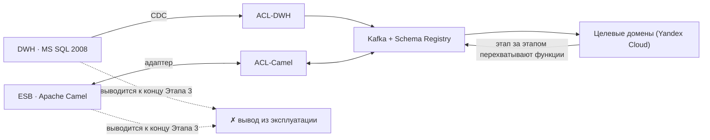

# Обоснование событийного подхода vs текущая шина Camel + DWH

Документ обосновывает переход «Будущего 2.0» на **событийную интеграцию**
(Apache Kafka + Schema Registry) взамен текущей связки **ESB Apache Camel +
монолитный DWH на MS SQL 2008** и показывает, как это повышает **гибкость,
масштабируемость и скорость реакции** системы.

---

## 1. Проблемы текущего ландшафта (AS-IS)

| Проблема | Следствие для бизнеса |
| --- | --- |
| Монолитный DWH с бизнес-логикой | Изменение в одном направлении требует правок в общем ядре → медленный time-to-market |
| Жёсткая синхронная связанность через ESB | Сбой/недоступность одного сервиса каскадно блокирует смежные |
| Аналитика поверх оперативного DWH | Тяжёлые отчёты формируются часами, конкурируют за ресурсы с операциями |
| Общая схема данных на всех | Домены не автономны, нет чётких границ владения данными |
| Точечные интеграции «сервис-к-сервису» | Рост числа связей O(n²), хрупкость и высокая стоимость поддержки |
| Пакетная (batch) загрузка | Нет near-real-time реакции на бизнес-события |

---

## 2. Преимущества событийного подхода

- **Слабая связанность.** Домены не знают о потребителях: продюсер публикует
  факт, подписчики реагируют независимо. Новый потребитель добавляется без
  изменения источника (O(n) вместо O(n²) связей).
- **Масштабируемость.** Партиционирование топиков по `aggregateId` даёт
  горизонтальное масштабирование потребителей; пиковые нагрузки сглаживаются
  буфером Kafka, а не ложатся на источник.
- **Near-real-time.** События обрабатываются в потоке (Kafka Streams / Flink):
  переход от «отчётов за часы» к реакции за секунды.
- **Автономия доменов.** Каждый домен владеет своей БД и контрактами; команды
  развиваются и релизятся независимо → быстрее time-to-market.
- **Устойчивость (resilience).** Асинхронность и буферизация: недоступность
  подписчика не роняет источник; ретраи и DLQ обеспечивают гарантию доставки.
- **Аудируемость и воспроизводимость.** Лог событий — источник правды: можно
  переиграть поток, восстановить проекции, разобрать инцидент по
  `correlationId`.
- **Гибкость аналитики (Data Mesh).** Домены публикуют data products; витрины
  строятся на потоках, не нагружая оперативные системы; self-service BI вместо
  кастомного Power BI.

---

## 3. Сравнительная таблица: ESB/DWH ↔ событийная архитектура

| Критерий | Синхронная интеграция (ESB Camel + DWH) | Событийная архитектура (Kafka + Schema Registry) |
| --- | --- | --- |
| Связанность | Жёсткая, точка-точка через шину и общую БД | Слабая, через публикацию/подписку событий |
| Тип взаимодействия | Синхронный запрос-ответ, batch-ETL | Асинхронные события, реактивные потоки |
| Масштабирование | Вертикальное, упирается в DWH | Горизонтальное (партиции, консюмер-группы) |
| Задержка данных | Часы (batch-отчёты) | Секунды (near-real-time) |
| Автономия команд | Низкая: общее ядро и схема | Высокая: своя БД и контракты у домена |
| Устойчивость к сбоям | Каскадные отказы, единая точка отказа | Изоляция сбоев, буферизация, ретраи, DLQ |
| Эволюция контрактов | Правки общей схемы, риск регрессий | Версионирование схем, обратная совместимость |
| Добавление потребителя | Новая интеграция и правки источника | Новая подписка без изменения источника |
| Аналитика | На оперативном DWH, конкуренция за ресурсы | Отдельные data products и потоковые витрины |
| Time-to-market | Медленный (изменения в монолите) | Быстрый (независимые релизы доменов) |
| Стоимость поддержки | Растёт как O(n²) связей | Растёт как O(n) подписок |

---

## 4. Как повышается гибкость и скорость реакции

- **Гибкость.** Подключение нового бизнес-направления (фарма, электроника) =
  подписка на нужные события + публикация своих. Ядро не трогаем — исчезает
  необходимость «зашивать» логику в DWH.
- **Скорость реакции.** Событие `Визит завершён` мгновенно триггерит биллинг,
  списание расходников и уведомления; `Пройдено исследование ИИ` сразу
  доставляет заключение врачу. Ранее это были ночные batch-циклы.
- **Скорость разработки.** Автономные домены с чёткими контрактами релизятся
  параллельно; изменения не блокируют друг друга.
- **Гибкость аналитики.** Аналитик собирает отчёт в self-service BI из готовых
  data products в рамках своих прав — без заявки в команду DWH.

---

## 5. Роль ACL и миграция по стратегии strangler-fig

Переход выполняется **эволюционно, без «большого взрыва»**: вокруг легаси
выстраивается новая событийная платформа, которая постепенно перехватывает
функции, пока DWH и Camel не будут выведены из эксплуатации.

- **Антикоррупционный слой (ACL).** Ни один целевой домен не зависит от модели
  DWH/Camel напрямую. `ACL-DWH` через CDC (Debezium) превращает изменения
  таблиц в нормализованные доменные события; `ACL-Camel` оборачивает
  существующие маршруты в адаптер «события ↔ команды». Легаси-модель не
  «протекает» в новые контексты.
- **Strangler-fig по этапам** (согласно канону трансформации):
  - **Этап 1 (0–6 мес):** пилот в 1–2 доменах (пациентский поток / финрасчёты),
    единые принципы событий, DLQ, Schema Registry; ACL читает историю из DWH.
  - **Этап 2 (6–18 мес):** расширение на критические домены, потоковые витрины,
    ACL для интеграций через Camel и DWH.
  - **Этап 3 (18–36 мес):** отказ от синхронных точечных интеграций на
    критическом пути; ACL-мосты гасятся домен за доменом, DWH/Camel выводятся.
- **Управление рисками.** На время миграции критичные потоки дублируются
  (легаси + событие), сверяются реестры, что позволяет откатиться и переключать
  трафик постепенно.

---

## 6. Вывод

Событийная архитектура снимает корневые ограничения текущего ландшафта:
устраняет жёсткую связанность через ESB и монолитный DWH, даёт доменам
автономию и near-real-time, снижает стоимость роста числа интеграций и
источников. Стратегия **ACL + strangler-fig** делает переход управляемым и
обратимым: легаси остаётся лишь временным «мостом совместимости» и планово
выводится из эксплуатации к концу трёхлетнего горизонта, а компания получает
слабосвязанную масштабируемую платформу для запуска новых мед- и
финтех-направлений.
