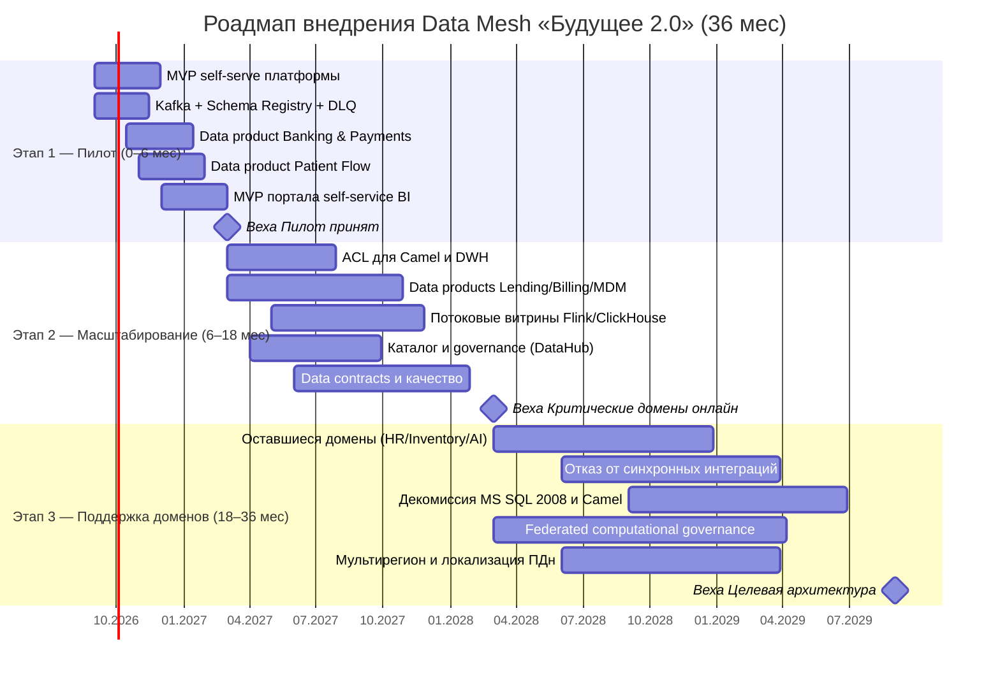
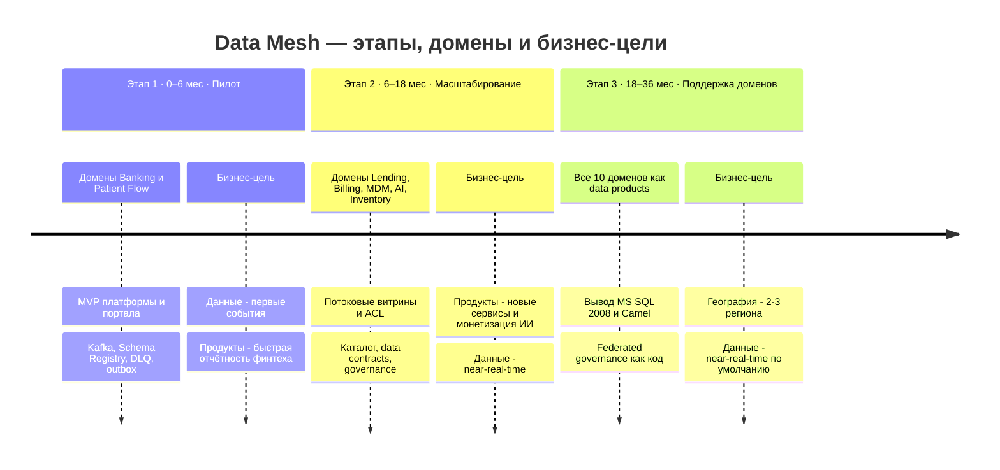

# Стратегический роадмап внедрения Data Mesh «Будущее 2.0»

Поэтапное внедрение **Data Mesh** и портала самообслуживания на горизонте 3 лет,
привязанное к трём этапам трансформации (0–6 / 6–18 / 18–36 мес) и бизнес-целям
компании (**Продукты · География · Данные**). Домены и стек едины с остальными
заданиями спринта (Task3, Task4).

> Аналитическая витрина **не включает** медкарты, истории болезни и результаты
> исследований (PHI). Домен EHR публикует только разрешённые события/метаданные.

## Ключевые роли

| Роль | Зона ответственности | Уровень |
| --- | --- | --- |
| **Data Product Owner (DPO)** | Владелец доменного data product: бэклог, качество, SLA, семантика, контракт данных, ценность для потребителей | Домен |
| **Data Engineer** | Пайплайны публикации data product: outbox → Kafka → lakehouse (Iceberg), трансформации dbt, потоковые витрины | Домен |
| **BI-аналитик** | Дашборды и отчёты в портале самообслуживания, метрики, самостоятельное конструирование срезов в рамках доступа | Домен / бизнес |
| **Platform Team (self-serve data platform)** | Платформа как продукт: шаблоны data product, CI/CD, Kafka/Schema Registry/DLQ, lakehouse, каталог, «золотой путь» | Центральная |
| **Data Governance / Data Steward** | Федеративное управление: каталог, контракты, качество, классификация PII/PHI, политики доступа, комплаенс | Кросс-доменная |

Поддерживающие роли: **Enabling team** (DDD/Kafka/Flink-энейблмент доменов),
**Security & Compliance Officer** (152-ФЗ, врачебная тайна, банковская лицензия),
**Domain Teams** (разработчики доменных сервисов).

### Модель ответственности (RACI, укрупнённо)

| Активность | DPO | Data Engineer | BI-аналитик | Platform Team | Governance/Steward |
| --- | :--: | :--: | :--: | :--: | :--: |
| Стратегия и бэклог data product | **A/R** | C | C | I | C |
| Публикация data product (пайплайн) | A | **R** | I | C | C |
| Контракт данных и SLA | **A** | R | C | C | R |
| Портал самообслуживания и отчёты | I | C | **R** | A | I |
| Платформа, шаблоны, «золотой путь» | I | C | I | **A/R** | C |
| Каталог, качество, классификация PII/PHI | C | R | I | C | **A/R** |
| Политики доступа и комплаенс | I | I | I | C | **A/R** |

_A — Accountable, R — Responsible, C — Consulted, I — Informed._

---

## Этап 1 — Пилот (0–6 мес)

| Параметр | Содержание |
| --- | --- |
| **Цели** | Доказать модель Data Mesh на 1–2 доменах; заложить единые принципы событий; MVP платформы и портала |
| **Домены** | **Banking & Payments** (финансовые расчёты), **Patient Flow** (пациентский поток) |
| **Что делаем** | MVP self-serve платформы; Kafka + Schema Registry + **DLQ**; outbox в пилотных сервисах; первые 2 data products; MVP портала (DataLens/Metabase); базовый каталог |
| **Роли** | Platform Team строит платформу; по одному DPO и Data Engineer на пилотный домен; Governance задаёт классификацию PII/PHI; BI-аналитики собирают первые дашборды |
| **Бизнес-цель** | **Данные:** первый переход от batch к событиям. **Продукты:** ускорение отчётности финтеха как база для новых сервисов |
| **Метрики успеха** | 2 data product в проде; отчёт пилотного домена: часы → **минуты**; 100% событий пилота через outbox; Schema Registry и DLQ внедрены; ≥5 активных авторов отчётов |

## Этап 2 — Масштабирование (6–18 мес)

| Параметр | Содержание |
| --- | --- |
| **Цели** | Расширить на критические домены; запустить потоковые витрины; ввести ACL для легаси; федеративное управление |
| **Домены** | **Lending** (кредитование), **Billing** (биллинг), **Customer/MDM** (единый профиль), **AI Diagnostics** (метаданные, без PHI), **Inventory** |
| **Что делаем** | **ACL** для интеграций через Camel и DWH; потоковые витрины (Kafka Streams/Flink → ClickHouse); dbt-трансформации; **data contracts**; каталог и governance (DataHub/OpenMetadata); расширение портала |
| **Роли** | DPO/Data Engineer в каждом новом домене; Platform Team развивает «золотой путь» и SLA платформы; Governance разворачивает каталог, контракты и политики доступа; Enabling team обучает домены |
| **Бизнес-цель** | **Продукты:** новые финтех/мед-сервисы на data products; монетизация ИИ (на неперсональных данных). **Данные:** near-real-time витрины |
| **Метрики успеха** | 6–7 доменов с data products; SLA потоковых витрин (свежесть < минут); покрытие каталога ≥80%; доля прямых обращений к DWH ↓; ≥50 активных авторов отчётов; data contract coverage ≥70% |

## Этап 3 — Поддержка доменов и федеративное управление (18–36 мес)

| Параметр | Содержание |
| --- | --- |
| **Цели** | Все домены как data products; отказ от синхронных интеграций на критпути; доменная аналитика на потоках; вывод легаси; выход в регионы |
| **Домены** | Оставшиеся: **Staff/HR**, **Inventory/Supply Chain** (полностью), **AI Diagnostics**, **Data Platform/Analytics** как зрелый продукт; кросс-доменные Compliance и Notifications |
| **Что делаем** | Отказ от точечных синхронных интеграций на критпути; декомиссия MS SQL 2008 DWH и Camel (strangler fig); federated computational governance (политики как код); мультирегион и локальные требования |
| **Роли** | Governance переходит к «политикам как код»; Platform Team — самообслуживание «под ключ»; DPO отвечают за зрелость и экономику продуктов; BI-аналитики — полностью на портале |
| **Бизнес-цель** | **География:** 2–3 новых региона с локализацией ПДн. **Продукты:** масштаб новых сервисов. **Данные:** near-real-time по умолчанию |
| **Метрики успеха** | 10 доменов с data products; критпуть без синхронных легаси-интеграций; MS SQL 2008 выведен из критпути; ≥60% потоков near-real-time; регионы в проде; реализуется экономия TCO (см. `tco-analysis.md`); рост NPS аналитиков |

> **О числе «10 доменов».** В Task4 (`bounded-contexts.md`) выделено **12 bounded
> contexts**. В аналитические **data products** попадают **10** из них: контекст
> **Medical Records / EHR** намеренно PHI-изолирован и в аналитическую витрину не
> выгружается (по условию — медкарты, истории болезней и результаты исследований
> не используются для аналитики), а **Compliance & Security** и **Notifications** —
> сквозные (supporting/generic) контексты уровня платформы (policy-as-code,
> уведомления), а не отдельные аналитические продукты. Итог: 12 контекстов → 10
> доменных data products.

---

## Привязка этапов к бизнес-целям

| Бизнес-цель | Этап 1 (0–6) | Этап 2 (6–18) | Этап 3 (18–36) |
| --- | --- | --- | --- |
| **Продукты** (новые фин/мед/ИИ-сервисы, монетизация ИИ) | База: ускорение отчётности финтеха | Новые сервисы на data products, монетизация ИИ | Масштаб продуктовой линейки |
| **География** (2–3 региона) | — | Подготовка мультитенантности | Выход в регионы, локализация ПДн (152-ФЗ) |
| **Данные** (рост источников/событий, batch → near-real-time) | Первые события, outbox, DLQ | Потоковые витрины, ACL к легаси | near-real-time по умолчанию, вывод легаси |

## Диаграмма Ганта (Mermaid)

## Таймлайн (Mermaid)

## Сводные метрики программы

| Метрика | Базлайн (AS-IS) | Этап 1 | Этап 2 | Этап 3 (цель) |
| --- | --- | --- | --- | --- |
| Доменов с data products | 0 | 2 | 6–7 | 10 |
| Время формирования отчёта | часы | минуты (пилот) | минуты (крит. домены) | секунды–минуты |
| Доля near-real-time потоков | ~0% | пилот | растёт | ≥60% |
| Покрытие каталога данных | нет | базовое | ≥80% | ~100% |
| Активные авторы отчётов (self-service) | мало | ≥5 | ≥50 | масштаб компании |
| Зависимость критпути от легаси | высокая | высокая | снижается | устранена |

## Связь с остальными артефактами

- **Домены / bounded contexts** — `Task4/bounded-contexts.md`.
- **Целевая архитектура (C4), эволюция, риски** — `Task3/`.
- **Технологический выбор и статусы** — `tech-radar.md`.
- **Экономика (окупаемость, экономия)** — `tco-analysis.md`.
