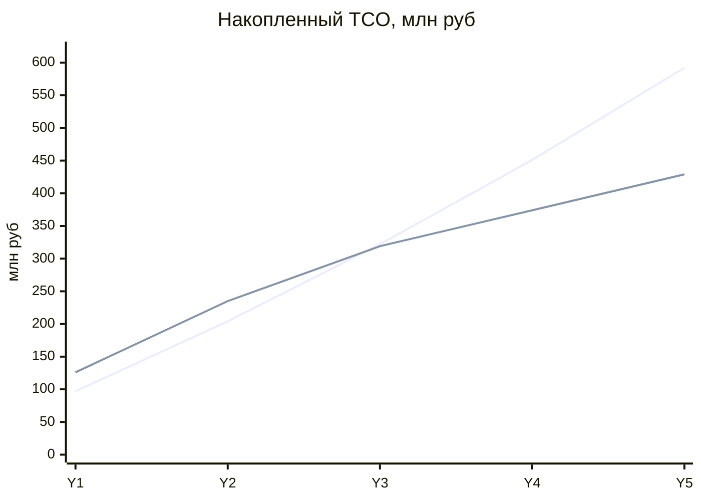

# TCO-анализ трансформации «Будущее 2.0»

Экономическое обоснование перехода от **текущей** архитектуры (монолитный DWH на
MS SQL Server 2008, Power BI, PowerBuilder, ESB Camel) к **целевой** (событийная
платформа в Yandex Cloud, Data Mesh, self-service BI). Сравнение TCO на горизонте
**3 лет** по ключевым статьям затрат, с периодом окупаемости и экономией.

> ⚠️ **Все цифры — иллюстративные, порядковые оценки** (модель для обоснования
> решения, а не коммерческое предложение вендора). Значения в **млн ₽**.
> Реальные суммы уточняются по факту инвентаризации, прайс-листам Yandex Cloud и
> результатам пилота Этапа 1.

## Статьи затрат

| Статья | Что включает |
| --- | --- |
| **Инфраструктура** | AS-IS: серверы, СХД на сотни ТБ, ЦОД, электроэнергия, амортизация. TO-BE: Yandex Cloud (Managed K8s, Object Storage, Managed PostgreSQL/Kafka/ClickHouse, DataProc) по модели pay-as-you-go |
| **Лицензии** | AS-IS: SQL Server Enterprise (SA/расширенная поддержка), Power BI (Premium + Pro), PowerBuilder/Appeon. TO-BE: open-source (Kafka, ClickHouse, Trino, dbt, Superset/Metabase, Iceberg, DataHub) + подписки на поддержку |
| **Сопровождение / поддержка** | Команды эксплуатации: DBA, поддержка PowerBuilder-клиента, кастомного Power BI, ESB; в TO-BE — platform team/SRE при разгрузке за счёт managed-сервисов |
| **Время аналитиков** | Стоимость медленной отчётности: простой аналитиков в ожидании отчётов «по часам», ручные трансформации; в TO-BE снижается за счёт self-service BI и near-real-time |
| **Миграция / обучение** | Разовые затраты программы: перенос сотен ТБ, ACL-мосты, найм/обучение, консалтинг, параллельный запуск (dual-run) |

## Ключевые допущения (assumptions)

1. **Аналитики:** ~40 человек, полная стоимость (loaded cost) ≈ **2.5 млн ₽/год**
   на человека. В AS-IS ~20% рабочего времени теряется на ожидание отчётов и
   ручные трансформации; в TO-BE — снижается до ~5% к концу горизонта.
2. **Данные:** сотни ТБ, рост объёма и числа событий ~15–20%/год → затраты AS-IS
   растут (инфраструктура, поддержка, деградация отчётности).
3. **Легаси:** MS SQL Server 2008 вне поддержки (mainstream/extended завершены) →
   платная расширенная/кастомная поддержка либо риск-премия; стоимость растёт.
4. **Облако:** Yandex Cloud, pay-as-you-go, managed-сервисы; разделение
   storage/compute (Object Storage дешевле для «холодных» сотен ТБ).
5. **Open-source** (Kafka, ClickHouse, Trino, dbt, Superset/Metabase, Iceberg,
   DataHub) — **без лицензионных отчислений**, но с расходами на поддержку/эксплуатацию.
6. **Программа** — 36 месяцев по 3 этапам; легаси работает как «мост совместимости»
   (dual-run) с выводом по strangler fig: доля легаси ~85% (Y1) → ~45% (Y2) → ~12% (Y3).
7. **Инфляция/рост AS-IS** ~8–10%/год; целевая платформа выходит на устойчивое
   состояние к концу Y3.
8. Налоги, курсовые разницы и NPV-дисконтирование для наглядности **не** учитываются.

---

## 1. Текущая архитектура (AS-IS) — «оставить легаси»

| Статья, млн ₽ | Y1 | Y2 | Y3 | Итого 3 г. |
| --- | ---: | ---: | ---: | ---: |
| Инфраструктура (on-prem) | 40 | 44 | 48 | 132 |
| Лицензии (SQL Server, Power BI, PowerBuilder) | 15 | 16 | 18 | 49 |
| Сопровождение / поддержка | 22 | 24 | 26 | 72 |
| Время аналитиков (медленная отчётность) | 20 | 23 | 26 | 69 |
| **Итого AS-IS** | **97** | **107** | **118** | **322** |

Затраты **растут** год к году: данные множатся, легаси дорожает в поддержке,
отчётность деградирует. Это «стоимость бездействия».

## 2. Целевая архитектура (TO-BE) — «трансформация»

Включает **остаточное легаси** (dual-run, убывает), **новую платформу** (растёт
до устойчивого состояния) и **разовые** затраты миграции/обучения.

| Статья, млн ₽ | Y1 | Y2 | Y3 | Итого 3 г. |
| --- | ---: | ---: | ---: | ---: |
| Инфраструктура (облако + остаток on-prem) | 42 | 40 | 36 | 118 |
| Лицензии (open-source + подписки + остаток) | 14 | 10 | 6 | 30 |
| Сопровождение / поддержка (platform team + остаток) | 23 | 21 | 19 | 63 |
| Время аналитиков (self-service, near-real-time) | 17 | 13 | 8 | 38 |
| Миграция / обучение (разовые) | 30 | 25 | 15 | 70 |
| **Итого TO-BE** | **126** | **109** | **84** | **319** |

Пик затрат — **Y1** (инвестиции в миграцию при ещё работающем легаси). К **Y3**
затраты падают: легаси выведено, аналитики разгружены, лицензии замещены
open-source.

## 3. Сравнение current vs target по годам

| млн ₽ | Y1 | Y2 | Y3 | Итого 3 г. |
| --- | ---: | ---: | ---: | ---: |
| Current (AS-IS) | 97 | 107 | 118 | 322 |
| Target (TO-BE) | 126 | 109 | 84 | 319 |
| **Разница за год** (Target − Current) | **+29** | **+2** | **−34** | **−3** |
| Накопленная разница | +29 | +31 | **−3** | — |

- **Y1–Y2** — фаза инвестиций: трансформация дороже (миграция + dual-run).
- **Y3** — целевая архитектура уже **дешевле на 34 млн ₽/год**.
- **За 3 года** сценарии выходят на **паритет** (даже с учётом разовой миграции
  трансформация на ~3 млн ₽ дешевле «бездействия»).

## 4. Устойчивое состояние и экономия (Y4+)

После завершения программы (без разовых затрат, легаси выведено):

| млн ₽/год | Y4 | Y5 |
| --- | ---: | ---: |
| Current (растёт ~9%/год) | 129 | 141 |
| Target (устойчивое состояние) | 55 | 55 |
| **Экономия в год** | **≈74** | **≈86** |

Устойчивая экономия — **≈55–60%** годового TCO относительно траектории «оставить
легаси», и разрыв **увеличивается** (AS-IS дорожает, TO-BE эластичен).

## 5. Период окупаемости

Накопленная разница TCO (Current − Target); положительное значение = трансформация
уже окупилась:

| Накопленно, млн ₽ | Y1 | Y2 | Y3 | Y4 | Y5 |
| --- | ---: | ---: | ---: | ---: | ---: |
| Current (нарастающим итогом) | 97 | 204 | 322 | 451 | 592 |
| Target (нарастающим итогом) | 126 | 235 | 319 | 374 | 429 |
| **Выгода (Current − Target)** | **−29** | **−31** | **+3** | **+77** | **+163** |

**Точка окупаемости — конец Y3 (~34–36 мес)**, совпадает с завершением Этапа 3.
Далее — быстрый рост выгоды: **≈163 млн ₽** накопленной экономии к концу Y5.

## Диаграммы (Mermaid)

### Годовой TCO: current vs target

```mermaid
xychart-beta
    title "Годовой TCO, млн руб (current vs target)"
    x-axis [Y1, Y2, Y3, Y4, Y5]
    y-axis "млн руб" 0 --> 160
    bar [97, 107, 118, 129, 141]
    bar [126, 109, 84, 55, 55]
```

_Первый ряд — Current (AS-IS), второй — Target (TO-BE). Target выше в Y1–Y2
(инвестиции), затем устойчиво ниже._

### Накопленный TCO и точка окупаемости

_Линии пересекаются к концу Y3 — момент окупаемости; далее кривые расходятся в
пользу Target._

## Выводы

| Показатель | Значение (оценочно) |
| --- | --- |
| TCO за 3 года, Current | ~322 млн ₽ |
| TCO за 3 года, Target | ~319 млн ₽ (паритет, включая миграцию) |
| Пик инвестиций | Y1 (+29 млн ₽ к сценарию бездействия) |
| Точка окупаемости | ~34–36 мес (конец Этапа 3) |
| Устойчивая экономия | ~74–86 млн ₽/год (≈55–60%) с Y4 |
| Накопленная выгода к Y5 | ~163 млн ₽ |

**Качественные эффекты (не оцифрованы, но существенны):** ускорение time-to-market
для новых финтех/мед/ИИ-продуктов, near-real-time аналитика, отказ от vendor
lock-in на закрытых лицензиях, эластичное масштабирование под рост данных и выход
в новые регионы, снижение рисков эксплуатации ПО вне поддержки (MS SQL 2008).

> Повторно: цифры **иллюстративные**. Модель показывает **порядок величин и
> направление эффекта**; для инвесткомитета уточняется после инвентаризации
> активов и пилота Этапа 1.
