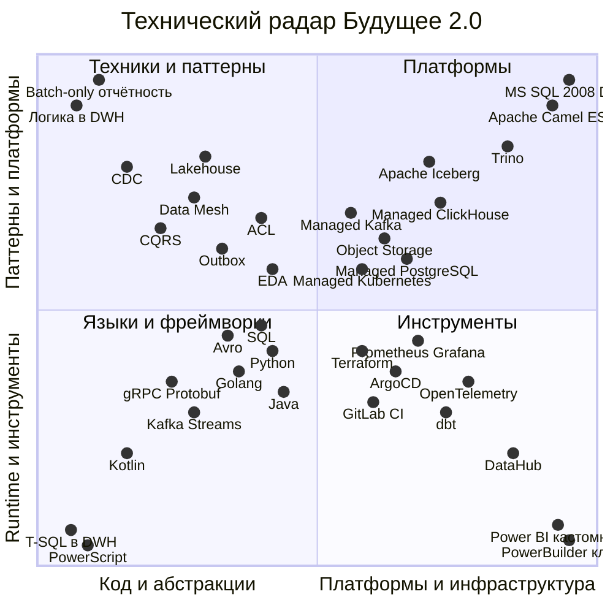
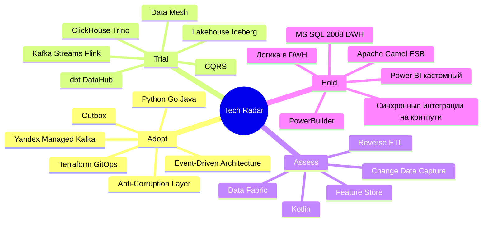

# Расширенный технический радар «Будущее 2.0»

Радар описывает **целевой технологический ландшафт** трансформации: не только
технологии, но и **архитектурные паттерны и техники**. Он единообразен с
остальными заданиями спринта (Yandex Cloud, событийная платформа, Data Mesh,
изоляция медицинского контура). Для каждого элемента указано **кольцо статуса**:
Adopt / Trial / Assess / Hold.

> Медкарты, истории болезни и результаты медисследований (PHI) **не попадают** в
> аналитическую витрину — это ограничение отражено в обоснованиях радара.

## Легенда колец

| Кольцо | Значение | Что делаем |
| --- | --- | --- |
| **Adopt** | Проверено, рекомендуется по умолчанию | Внедряем как стандарт де-факто |
| **Trial** | Готовы применять на реальных задачах, но с контролем рисков | Пилотируем на выделенных доменах |
| **Assess** | Перспективно, изучаем | Делаем PoC, оцениваем применимость |
| **Hold** | Не начинать новое; выводить из эксплуатации | Только «мост совместимости», strangler fig |

## Квадранты

| Квадрант | Что входит |
| --- | --- |
| **Techniques / Patterns** (Техники и паттерны) | Архитектурные и процессные подходы: EDA, Data Mesh, CQRS, Outbox, ACL, Lakehouse, GitOps, Saga, DDD, Data Contracts |
| **Platforms** (Платформы) | Среды исполнения и хранения: Yandex Cloud managed-сервисы, Kafka, ClickHouse, Iceberg, Trino, Vault, легаси-платформы |
| **Tools** (Инструменты) | Инструментарий разработки, данных и эксплуатации: Terraform, ArgoCD, dbt, DataHub, observability, BI-инструменты |
| **Languages & Frameworks** (Языки и фреймворки) | Языки и фреймворки сервисов и данных: Python, Go, Java, Kafka Streams, gRPC/Protobuf, Avro, SQL |

## Радар (Mermaid quadrantChart)

Каждый квадрант диаграммы соответствует квадранту радара. **Чем ближе точка к
центру (0.5, 0.5), тем ближе кольцо к Adopt; периферия — Hold.** Показаны
репрезентативные элементы; полный перечень — в таблицах ниже.

## Сгруппированный список по кольцам (Mermaid mindmap)

---

## Квадрант 1. Techniques / Patterns (Техники и паттерны)

| Элемент | Квадрант | Кольцо | Обоснование |
| --- | --- | --- | --- |
| Event-Driven Architecture (EDA) | Techniques/Patterns | **Adopt** | Ядро целевой платформы: домены общаются событиями через Kafka, слабая связанность вместо жёсткой через ESB/DWH |
| Outbox pattern | Techniques/Patterns | **Adopt** | Решает dual-write (R01): атомарная публикация событий из БД домена, гарантия «не потерять/не задвоить» |
| Anti-Corruption Layer (ACL) | Techniques/Patterns | **Adopt** | Изолирует новые домены от легаси; «мосты совместимости» к Camel и DWH на время миграции без протечки чужой модели |
| Domain-Driven Design / Bounded Contexts | Techniques/Patterns | **Adopt** | Основа декомпозиции на 10 доменов (см. Task4); чёткие границы контекстов и контрактов |
| Schema-on-write / контракты схем | Techniques/Patterns | **Adopt** | Schema Registry (Avro/Protobuf) как единый каталог схем, контроль совместимости эволюции событий (R04) |
| Strangler Fig (постепенный вывод легаси) | Techniques/Patterns | **Adopt** | Стратегия вывода MS SQL 2008/Camel/PowerBuilder без «большого взрыва»; поэтапная замена по доменам |
| GitOps | Techniques/Patterns | **Adopt** | Декларативные развёртывания (ArgoCD), воспроизводимость сред доменов, аудит изменений |
| Data Mesh | Techniques/Patterns | **Trial** | Целевая парадигма аналитики: доменные data products, self-serve платформа, федеративное управление; внедряется поэтапно с пилота |
| Self-service BI | Techniques/Patterns | **Trial** | Портал самообслуживания (DataLens/Metabase/Superset) вместо кастомного Power BI; пилот на 1–2 доменах, затем масштабирование |
| Lakehouse | Techniques/Patterns | **Trial** | Object Storage + Iceberg как единый слой хранения аналитики; заменяет монолитный DWH, разделяет compute и storage |
| CQRS | Techniques/Patterns | **Trial** | Разделение команд и чтения для нагруженных доменов (Banking, Patient Flow); потоковые read-модели/витрины |
| Saga (оркестрация/хореография) | Techniques/Patterns | **Trial** | Распределённые бизнес-процессы (платёж + биллинг + кредит) без 2PC; компенсирующие транзакции (R05) |
| Data Contracts | Techniques/Patterns | **Trial** | Формализованные контракты data products (схема, SLA, семантика, владелец); защита от «озера-болота» (R06) |
| Потоковые витрины (streaming analytics) | Techniques/Patterns | **Trial** | Near-real-time аналитика на Kafka Streams/Flink → ClickHouse; переход от batch к потоку (Этап 2–3) |
| Change Data Capture (CDC) | Techniques/Patterns | **Assess** | Debezium/Kafka Connect для вычитывания изменений из легаси-БД в события на период миграции; оцениваем нагрузку на MS SQL |
| Reverse ETL | Techniques/Patterns | **Assess** | Возврат агрегатов из витрин в операционные системы; оцениваем нишевые сценарии активации данных |
| Feature Store | Techniques/Patterns | **Assess** | Управление признаками для ИИ-сервисов; PoC на неперсональных/обезличенных данных, без PHI в аналитике |
| Data Fabric | Techniques/Patterns | **Assess** | Альтернатива/дополнение к Data Mesh (метаданные-центричная интеграция); изучаем, приоритет за Data Mesh |
| Zero Trust security | Techniques/Patterns | **Assess** | Усиление модели доступа (mTLS, микросегментация); оцениваем для медицинского и банковского контуров |
| Бизнес-логика в DWH (хранимые процедуры) | Techniques/Patterns | **Hold** | Ключевой антипаттерн AS-IS: сотни ТБ логики в MS SQL 2008; логику выносим в доменные сервисы, новое не добавляем |
| Точечные синхронные интеграции на критпути | Techniques/Patterns | **Hold** | Жёсткая связанность через ESB/DWH; на критическом пути заменяются событиями (отказ на Этапе 3) |
| Batch-only отчётность | Techniques/Patterns | **Hold** | Ночные пакетные ETL и «отчёты по часам»; замещаются потоковыми/near-real-time витринами |

## Квадрант 2. Platforms (Платформы)

| Элемент | Квадрант | Кольцо | Обоснование |
| --- | --- | --- | --- |
| Yandex Managed Kubernetes | Platforms | **Adopt** | Единая среда исполнения доменных сервисов; автоскейлинг, изоляция сред по доменам |
| Yandex Object Storage (S3) | Platforms | **Adopt** | Дешёвое масштабируемое хранилище для lakehouse (сотни ТБ), разделение storage/compute |
| Yandex Managed Service for Kafka | Platforms | **Adopt** | Событийная шина платформы + Schema Registry + DLQ; замена интеграций через Camel/DWH |
| Yandex Managed PostgreSQL | Platforms | **Adopt** | БД на домен (database per service), операционные данные bounded contexts |
| HashiCorp Vault | Platforms | **Adopt** | Секреты, ключи шифрования, ротация; требование безопасности мед/фин контуров |
| API Gateway | Platforms | **Adopt** | Единая точка входа REST/gRPC, аутентификация, rate limiting, версия контрактов |
| Yandex Managed ClickHouse | Platforms | **Trial** | Аналитический движок для потоковых витрин и self-service BI; проверяем SLA под ростом нагрузки (R10) |
| Apache Iceberg (table format) | Platforms | **Trial** | Открытый табличный формат lakehouse: ACID, time-travel, эволюция схемы поверх Object Storage |
| Yandex DataProc (Spark) | Platforms | **Trial** | Пакетные трансформации и миграция исторических данных из DWH; используется в переходный период |
| Apache Flink | Platforms | **Trial** | Сложная потоковая обработка с состоянием (окна, джойны) для критических доменов |
| Yandex DataLens | Platforms | **Trial** | Управляемый BI как часть портала самообслуживания; альтернатива/дополнение к Metabase/Superset |
| Trino (query engine) | Platforms | **Trial** | Федеративные SQL-запросы к lakehouse и разным источникам; оцениваем как основной движок доступа к data products |
| MS SQL Server 2008 (DWH-монолит) | Platforms | **Hold** | Легаси-ядро AS-IS: вне поддержки, монолит с логикой, сотни ТБ, отчёты часами; только «мост», вывод к концу Этапа 3 |
| Apache Camel ESB | Platforms | **Hold** | Легаси-шина: жёсткая связанность; сохраняется как «мост совместимости» через ACL, затем декомиссия |
| On-prem железо / собственный ЦОД | Platforms | **Hold** | Дорого в сопровождении, не масштабируется эластично; переезд в Yandex Cloud |

## Квадрант 3. Tools (Инструменты)

| Элемент | Квадрант | Кольцо | Обоснование |
| --- | --- | --- | --- |
| Terraform (IaC) | Tools | **Adopt** | Инфраструктура как код для Yandex Cloud; переиспользуемые модули (см. Task1/Task2), воспроизводимость |
| GitLab CI / GitHub Actions | Tools | **Adopt** | CI/CD конвейеры сервисов и data-пайплайнов; единый процесс поставки |
| Prometheus + Grafana | Tools | **Adopt** | Метрики и дашборды платформы и доменов; SLO/алертинг |
| ELK / Loki | Tools | **Adopt** | Централизованные логи; расследование инцидентов |
| Schema Registry | Tools | **Adopt** | Каталог схем событий (Avro/Protobuf), контроль совместимости — требование Этапа 1 |
| ArgoCD (GitOps CD) | Tools | **Trial** | Декларативная доставка в Kubernetes; выкатываем как стандарт по мере роста числа доменов |
| dbt (трансформации) | Tools | **Trial** | Версионируемые SQL-трансформации data products; тесты качества, документация моделей |
| OpenTelemetry | Tools | **Trial** | Сквозная трассировка событийных цепочек (R12); внедряем на критических доменах |
| Metabase / Superset | Tools | **Trial** | Open-source BI портала самообслуживания; замена кастомного Power BI без лицензий |
| Kafka Connect / Debezium | Tools | **Trial** | Коннекторы CDC и интеграции с легаси на период миграции |
| DataHub / OpenMetadata | Tools | **Assess** | Каталог данных и data governance для Data Mesh; выбираем между DataHub и OpenMetadata (PoC) |
| Great Expectations (data quality) | Tools | **Assess** | Автоматические проверки качества data products; оцениваем интеграцию в dbt/пайплайны |
| Power BI (кастомный поверх DWH) | Tools | **Hold** | Легаси-BI с множеством кастомизаций; лицензии и жёсткая привязка к DWH; замена на self-service BI |
| PowerBuilder клиент оператора | Tools | **Hold** | Устаревший толстый клиент; замещается веб-интерфейсами доменов и порталом; вывод из эксплуатации |

## Квадрант 4. Languages & Frameworks (Языки и фреймворки)

| Элемент | Квадрант | Кольцо | Обоснование |
| --- | --- | --- | --- |
| Python | Languages & Frameworks | **Adopt** | ИИ-сервисы, data engineering, dbt-окружение; уже в компании, сохраняем и развиваем |
| Golang | Languages & Frameworks | **Adopt** | Финтех-сервисы (высоконагруженные, низкая латентность); каноничный стек финтеха |
| Java | Languages & Frameworks | **Adopt** | Финтех-сервисы; экосистема Kafka/Flink; сохраняем |
| Avro | Languages & Frameworks | **Adopt** | Основной формат сериализации событий со Schema Registry; компактность и эволюция схем |
| SQL (ANSI / ClickHouse / Trino) | Languages & Frameworks | **Adopt** | Язык доступа к data products и витринам; переносимый навык аналитиков |
| REST / OpenAPI | Languages & Frameworks | **Adopt** | Синхронные контракты API там, где событий недостаточно; стандарт документации |
| Kafka Streams | Languages & Frameworks | **Trial** | Легковесная потоковая обработка внутри JVM-сервисов; потоковые витрины/агрегаты |
| gRPC / Protobuf | Languages & Frameworks | **Trial** | Эффективные синхронные вызовы и типобезопасные контракты между доменами |
| Spring Boot | Languages & Frameworks | **Trial** | Фреймворк для Java-сервисов; стандартизируем каркас доменных сервисов |
| Kotlin | Languages & Frameworks | **Assess** | Альтернатива Java для JVM-сервисов; оцениваем на новых доменах |
| T-SQL: бизнес-логика в хранимых процедурах | Languages & Frameworks | **Hold** | Логика внутри DWH — источник связанности и медленного time-to-market; новую не пишем, существующую выносим |
| PowerScript (PowerBuilder) | Languages & Frameworks | **Hold** | Язык устаревшего клиента; вывод вместе с PowerBuilder |

---

## Особое внимание: легаси в кольце Hold

Согласно условию и общему канону, **всё легаси-ядро AS-IS помещено в Hold** и
существует только как «мост совместимости» через антикоррупционные слои, с
выводом по стратегии strangler fig к концу Этапа 3:

| Легаси-элемент | Квадрант | Кольцо | Стратегия вывода |
| --- | --- | --- | --- |
| SQL Server 2008 DWH-монолит | Platforms | **Hold** | ACL + CDC → перенос доменных данных в БД доменов и lakehouse; декомиссия ядра |
| Бизнес-логика в DWH (T-SQL) | Techniques + Languages | **Hold** | Вынос логики в доменные сервисы (DDD); прекращение доработок процедур |
| PowerBuilder-клиент | Tools + Languages | **Hold** | Замена веб-интерфейсами доменов и порталом самообслуживания |
| Кастомный Power BI поверх DWH | Tools | **Hold** | Миграция отчётов на self-service BI (DataLens/Metabase/Superset) |
| Точечные синхронные интеграции (ESB/DWH) | Techniques | **Hold** | Замена событиями через Kafka; отказ на критпути на Этапе 3 |
| Apache Camel ESB | Platforms | **Hold** | ACL-мост на время миграции, затем декомиссия |

## Сводка по кольцам

| Кольцо | Кол-во элементов | Доля | Комментарий |
| --- | --- | --- | --- |
| **Adopt** | 24 | ~38% | Проверенное ядро целевой платформы |
| **Trial** | 21 | ~33% | Активно пилотируется по доменам (Data Mesh, стриминг) |
| **Assess** | 8 | ~13% | PoC и исследование применимости |
| **Hold** | 10 | ~16% | Легаси и антипаттерны — вывод из эксплуатации |
| **Итого** | **63** | 100% | 4 квадранта |

## Принципы и примечания

- **Изоляция PHI.** Медкарты, истории болезни, результаты исследований не
  включаются в аналитическую витрину; изоляция закреплена контрактами данных и
  сетевым контуром (домен EHR публикует только разрешённые события/метаданные).
- **Yandex Cloud по умолчанию.** Managed-сервисы предпочтительны для снижения
  эксплуатационной нагрузки; open-source-компоненты (Kafka, ClickHouse, Trino,
  dbt, Superset, Iceberg, DataHub) устраняют лицензионную зависимость.
- **Соответствие этапам трансформации.** Adopt/Trial-элементы вводятся по трём
  этапам (0–6 / 6–18 / 18–36 мес); Hold-элементы синхронно выводятся.
- **Соответствие остальным заданиям.** Домены — из Task4 (bounded contexts),
  целевая архитектура — из Task3 (C4), инфраструктура — из Task1/Task2 (Terraform).
